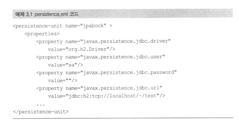
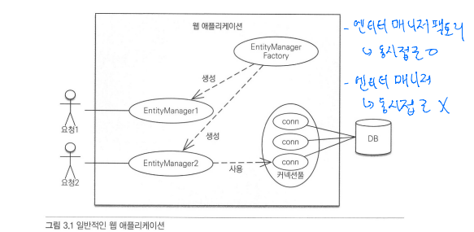
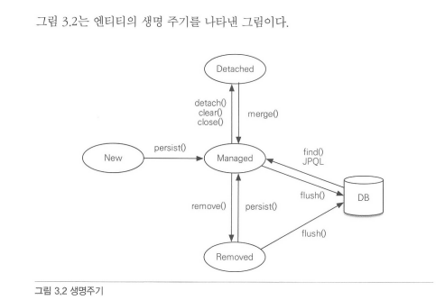
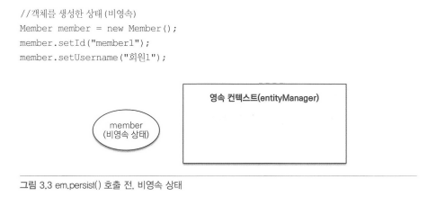

# 영속성관리

```
엔티티 매니저는 엔티티를 저장하고, 수정하고, 삭제하고, 조회하는 등 엔티티와 관련된 모든 일을 처리한다.
```

## 3.1 엔티티 매니저 팩토리와 엔티티 매니저

DB를 하나만 사용하는 애플리케이션은 일반적으로 EntityManager Factory를 하나만 생성한다.

```
//엔티티 매니저 팩토리 코드 비용이 많이든다.

EntityManagerFactory emf = Persistence.createEntityManagerFactory("jpabook");

```
EntityManagerFactory emf = Persistence.createEntityManagerFactory("jpabook") 를 호출하면
META-INF/persistence.xml에 있는 정보를 바탕으로 EntityManagerFactory를 생성한다.



이제부터 필요할 때마다 엔티티 매니저 팩리에서 엔티티 매니저를 생성하면 된다.

```
//공장에서 엔티티 매니저 생성, 비용이 거의 안 든다.

EntityManager em = emf.createEntityManager();

```
<Strong>
엔티티 매니저 팩토리는 이름 그대로 엔티티 매니저를 만드는 공장이다.
공장을 만드는 비용은 상당히 크기 때문에, 한 개만 만들어서 애플리케이션 전체에서 공유하도록 설계되어 잇다.
또한 엔티티 매니저 팩토리는 여러 스레드가 동시에 접근해도 안전하므로 서로 다른 스레드 간에 공유해도 되지만, 
<u>
엔티티 매니저는 여러 스레드가 동시에 접근하면 동시성 문제가 발생함로 스레드 간에 절대 공유하면 안 된다.
</u>
</Strong>

<br>



<br>
<br>
<br>

## 3.2 영속성 컨텍스트(persistence context)란

```
'엔티티를 영구 저장하는 환경'

엔티티 매니저로 엔티티를 저장하거나 조회하면 엔티티 매니저는 영속성 켄텍스트에 엔티티를 보관하고 관리한다.

```

em.persist(member) 
<br>
persist() 메소드는 엔티티 매니저를 사용해서 회원 엔티티를 영속성 컨텍스트에 저장한다.
<br>
영속성 컨텍스트는 엔티티 매니저를 생성할 때 하나 만들어진다.
그리고 엔티티 매니저를 통해서 영속성 컨텍스트에 접근할 수 있고, 영속성 컨텍스트를 관리할 수 ㅇㅆ다.

<br>
<br>
<br>

## 3.3 엔티티의 생명주기

엔티티에는 4가지 상태가 존재한다.
* 비영속 : 영속성 컨텍스트와 전혀 관계가 없는 상태
* 영속 : 영속성 컨텍스트에 저장된 상태
* 준영속 : 영속성 컨텍스트에 저장되었다가 분리된 상태
* 삭제 : 삭제된 상태



* 비영속
  엔티티 객체를 생성했다. 지금은 순수한 객체 상태이며 아직 저장하지 않았다. 따라서 
  <U>
  영속성 컨텍스트나 DB와는 전혀 관련이 없다.
  </U>

    

* 영속
  엔티티 매니저를 통해서 엔티티를 영속성 컨텍스트에 저장했다.
  <U>
  영속성 컨텍스트가 관리하는 엔티티를 영속 상태라 한다.
  </U>