# 영속성관리

```
엔티티 매니저는 엔티티를 저장하고, 수정하고, 삭제하고, 조회하는 등 엔티티와 관련된 모든 일을 처리한다.
```

## 3.1 엔티티 매니저 팩토리와 엔티티 매니저

DB를 하나만 사용하는 애플리케이션은 일반적으로 EntityManager Factory를 하나만 생성한다.

```
//엔티티 매니저 팩토리 코드 비용이 많이든다.

EntityManagerFactory emf = Persistence.createEntityManagerFactory("jpabook");

```
EntityManagerFactory emf = Persistence.createEntityManagerFactory("jpabook") 를 호출하면
META-INF/persistence.xml에 있는 정보를 바탕으로 EntityManagerFactory를 생성한다.


이제부터 필요할 때마다 엔티티 매니저 팩리에서 엔티티 매니저를 생성하면 된다.

```
//공장에서 엔티티 매니저 생성, 비용이 거의 안 든다.

EntityManager em = emf.createEntityManager();

```
<Strong>
엔티티 매니저 팩토리는 이름 그대로 엔티티 매니저를 만드는 공장이다.
공장을 만드는 비용은 상당히 크기 때문에, 한 개만 만들어서 애플리케이션 전체에서 공유하도록 설계되어 잇다.
또한 엔티티 매니저 팩토리는 여러 스레드가 동시에 접근해도 안전하므로 서로 다른 스레드 간에 공유해도 되지만, 
<u>
엔티티 매니저는 여러 스레드가 동시에 접근하면 동시성 문제가 발생함로 스레드 간에 절대 공유하면 안 된다.
</u>
</Strong>

<br>


<br>
<br>
<br>

## 3.2 영속성 컨텍스트(persistence context)란

```
'엔티티를 영구 저장하는 환경'

엔티티 매니저로 엔티티를 저장하거나 조회하면 엔티티 매니저는 영속성 켄텍스트에 엔티티를 보관하고 관리한다.

```

em.persist(member) 
<br>
persist() 메소드는 엔티티 매니저를 사용해서 회원 엔티티를 영속성 컨텍스트에 저장한다.
<br>
영속성 컨텍스트는 엔티티 매니저를 생성할 때 하나 만들어진다.
그리고 엔티티 매니저를 통해서 영속성 컨텍스트에 접근할 수 있고, 영속성 컨텍스트를 관리할 수 있다.

<br>
<br>
<br>

## 3.3 엔티티의 생명주기

엔티티에는 4가지 상태가 존재한다.
* 비영속 : 영속성 컨텍스트와 전혀 관계가 없는 상태
* 영속 : 영속성 컨텍스트에 저장된 상태
* 준영속 : 영속성 컨텍스트에 저장되었다가 분리된 상태
* 삭제 : 삭제된 상태


* 비영속 
  엔티티 객체를 생성했다. 지금은 순수한 객체 상태이며 아직 저장하지 않았다. 따라서 
  <U>
  영속성 컨텍스트나 DB와는 전혀 관련이 없다.
  </U>

    

* 영속
  엔티티 매니저를 통해서 엔티티를 영속성 컨텍스트에 저장했다.
  **영속성 컨텍스트가 관리하는 엔티티를 영속 상태라 한다.**
    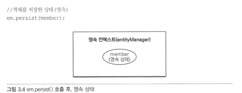

    회원 엔티티는 비영속 상태에서 영속 상태가 되었다.
    **결국 영속 상태라는 것은 영속 컨텍스트에 의해 관리된다는 뜻이다.**
  
* 준영속
  영속성 컨텍스트가 관리하던 영속 상태의 엔티티를 영속성 컨텍스트가 관리하지 않으면 준영속 상태가 된다.
  특정 엔티티를 준영속 상태로 만들려면 em.detach()를 호출하면 된다.
  em.close()를 호출해서 영속성 컨텍스트를 닫거나 em.clear()를 호출해서 영속성 컨텍스트를 초기화해도 영속성 컨텍스트가 관리하던 영속 상태의 엔티티는 준영속 상태가 된다.

* 삭제
  엔티티를 영속성 컨텍스트와 데이터베이스에서 삭제한다.

<br>
<br>
<br>

## 3.4 영속성 컨텍스트의 특징

* 영속성 컨텍스트와 식별자 값 <br>
  영속성 컨텍스트는 엔티티를 식별자 값으로 구분한다. 따라서 영속 상태는 식별자 값이 반드시 있어야 한다. 식별자 값이 없으면 예외가 발생한다.

* 영속성 컨텍스트와 데이터베이스 저장 <br>
  JPA는 보통 트랜잭션을 커밋하는 순간 영속성 컨텍스트에 새로 저장된 엔티티를 데이터베이스에 반영한다 이를 플러시(flish)라고 한다.

* 영속성 컨텍스트가 엔티티를 관리하면 다음과 같은 장점이 있다.
  * 1차 캐시
  * 동일성 보장
  * 트랜잭션을 지원하는 쓰기 지원
  * 변경 감지
  * 지연 로딩

### 3.4.1 엔티티 조회

```
영속성 컨텍스트는 내부에 캐시를 가지고 있는데 이를 1차 캐시라고 한다. 영속 상태의 엔티티는 모두 이곳에 저장된다.
쉽게 말해 영속성 컨텍스트 내부에 Map이 있으며 키는 @id로 매핑한 식별자이고 값은 엔티티 인스턴스이다.
```

```
//엔티티를 생성한 상태 (비영속)
Member member = new Member();
member.setId("member1");
member.setUsename("회원");

//엔티티를 영속
em.persist(member)

해당 코드를 실행하면 1차 캐시에 회원 엔티티를 저장한다.
다만 아직 데이터베이스에는 저장되지 않았다.
``` 

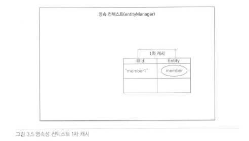

1차 캐시의 키는 식별자 값이다. 그리고 식별자 값은 데이터베이스 기본 키와 매핑되어 있다.<br> 
**따라서 영속성 컨텍스트에 데이터를 저장하고 조회하는 모든 기준은 데이터베이스 기본 키 값이다.**

```
Member member - em.find(Member.class, "member1");

find메소드의 첫 번째 파라미터는 엔티티 클래스의 타입이고
두 번째는 엔티티의 식별자 값이다.

public <T> T find(Class<T> entityClass, Object primaryKey);
```

**em.find()를 호출하면 먼저 1차 캐시에서 엔티티를 찾고 찾는 엔티티가 없을 경우 데이터베이스에서 조회한다.**

1차 캐시에서 조회
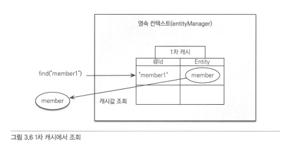

데이터베이스에서 조회
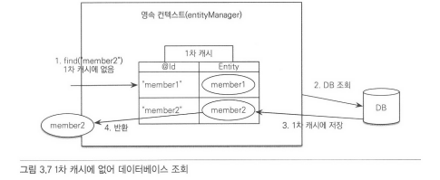

1. em.find(Member.class, "member2")를 실행한다.
2. member2가 1차 캐시에 없으므로 데이터베이스에서 조회한다.
3. 조회한 데이터로 member2 엔티티를 생성해서 1차 캐시에 저장한다(영속상태)
4. 조회한 엔티티를 반환한다.

<br>

#### 영속 엔티티의 동일성 보장

```
Member a = em.find(Member.class; "member1");
Member b = em.find(Member.class; "member1");

a == b //동일성 비교
```
em.find(Member.class; "member1")를 반복해서 호출해도 영속성 컨텍스트는 1차 캐시에 있는 엔티티 인스턴스를 반환한다.

### 3.4.2 엔티티 등록

엔티티 매니저는 트랜잭션을 커밋하기 직전까지 데이터베이스에 엔티티를 저장하지 않고 내부 쿼리 저장소에 INSERT SQL을 모아둔다.
트랜잭션을 커밋할 때 모아둔 쿼리를 데이터베이스에 보내는데 이것을 트랜잭션을 지원하는 쓰기 지연이라 한다.

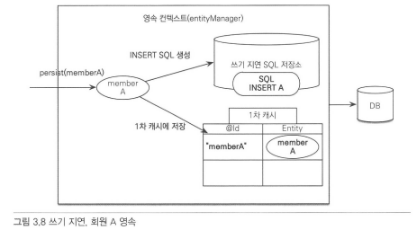

영속성 컨텍스트는 1차 캐시에 회원 엔티티를 저장하면서 동시에 회원 엔티티 정보로 등록 쿼리를 만든다. 그리고 만들어진 등록 쿼리를 쓰기 지연 SQL저장소에 보관한다.

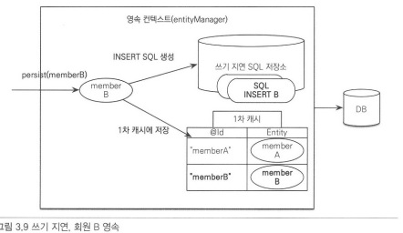

회원 B를 영속화 했다. 마찬가지로 회원 엔티티 정보로 등록 쿼리를 생성해서 쓰기 지연 SQL 저장소에 보관한다.

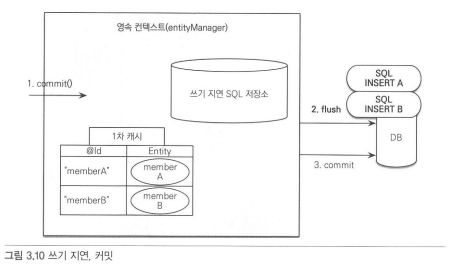

트랜잭션을 커밋하면 엔티티 매니저는 우선 영속성 컨텍스트를 플러시한다.

<br>
<br>

### 3.4.3 엔티티 수정

#### 변경감지

JPA로 엔티티를 수정할 때는 SQL문을 만드는 것이 아니라 단순히 **엔티티를 조회해서 데이터만 변경하면 된다.**

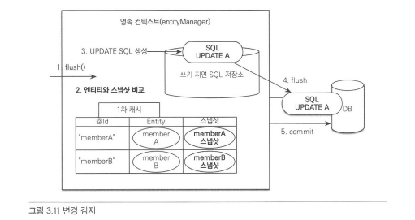

JPA는 엔티티를 영속성 컨텍스트에 보관할 때, 최초 상태를 복사해서 저장해둔다. 이를 스냅샵이라고 하며 플러시 시점에서 스냅샷과 엔티티를 비교하여 변경된 엔티티를 찾는다.

1. 트랜잭션을 커밋하면 엔티티 매니저 내부에서 먼저 플러시가 발생한다.
2. 엔티티와 스냅샷을 비교해서 변경된 엔티티를 찾는다.
3. 변경된 엔티티가 있으면 수정 쿼리를 생성해서 쓰기 지연 SQL저장소에 보낸다.
4. 쓰기 지연 저장소의 SQL을 데이터베이스에 보낸다.
5. 데이터베이스 트랜잭션을 커밋한다.

**변경 감지는 영속성 컨텍스트가 관리하는 영속 상태의 엔티티에서만 적용된다**
비영속, 준영속처럼 영속성 컨텍스트의 관리를 받지 못하는 엔티티는 값을 변겨애도 데이터베이스에 반영되지 않는다.

JPA의 업데이트 기본 전략은 엔티티의 모든 필드를 업데이트 한다.

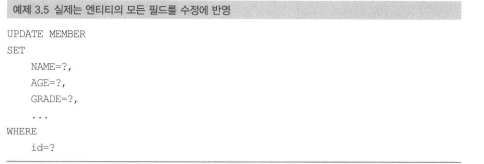

해당 전략은 데이터 전송량이 증가하는 단점도 있지만 다음과 같은 장점도 있다.

* 모든 필드를 사용하면 수정 쿼리가 항상 같다. 따라서 애플리케이션 로딩 시점에 수정 쿼리를 미리 생성해두고 재사용할 수 있다.
* 데이터베이스에 동일한 쿼리를 보내면 데이터베이스는 이전에 한 번 파싱된 쿼리를 재사용할 수 있다.

### 3.4.4 엔티티 삭제

엔티티를 삭제하려면 먼저 삭제 대상 엔티티를 조회해야 한다.
```
Member memberA = em.find(Member.class, "MemberA");//삭제 대상 엔티티 조회

em.remove(memberA); //엔티티 삭제

```
em.remove() 삭제 대상 엔티티를 넘겨주면 엔티티를 삭제한다.
물론 바로 삭제하는 것이 아닌 persist와 마찬가지로 삭제 쿼리를 쓰기 지연 sql 저장소에 등록한다. 참고로 em.remove()를 호출하는 순간 영속성 컨텍스트에서 제거된다.

<br>
<br>
<br>

## 3.5 플러시

플러시는 영속성 컨텍스트의 변경 내용을 데이터베이스에 반영한다.

1. 변경 감지가 동작해서 영속성 컨텍스트에 있는 모든 엔티티를 스냅샷과 비교해서 수정된 엔티티를 찾는다. 수정된 엔티티는 수정 쿼리를 만들어 쓰기 지연 sql저장소에 등록한다.
2. 쓰기 지연 sql 저장소의 쿼리를 데이터베이스에 전송한다.

영속성 컨텍스트를 플러시하는 방법
1. em.flush() 호출
2. 트랜잭션 커밋 시 플러시가 자동 호출된다.
3. JPQL 쿼리 실행 시 플러시가 자동 호출된다.

```
플러시는 영속성 컨텍스트에 보관된 엔티티를 지우는 것이 아닌 영속성 컨텍스트의 변경 내용을 데이터베이스에 동기화하는 것이 플러시이다.
```

## 3.6 준영속

```
영속성 컨텍스트가 관리하는 영속 상태의 엔티티가 영속성 컨텍스트에서 분리돈것을 준영속이라고 한다.
따라서 준영속 상태의 엔티티는 영속성 컨텍스트가 제공하는 기능을 사용할 수 없다.
```

엔티티를 준영속 상태로 만드는 방법
1. em.detach(entity) : 특정 엔티티만 준영속 상태로 전환한다.
2. em.clear() : 영속성 컨텍스트를 완전히 초기화 한다.
3. em.close() : 영속성 컨텍스트를 종료한다.

### 3.6.1 엔티티를 준영속 상태로 전환 :detach()

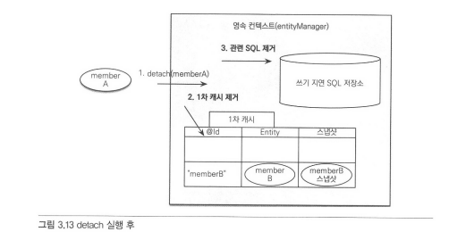
영속상태였다가 더는 영속성 컨텍스트가 관리하지 않는 상태

### 3.6.2 영속성 컨텍스트 초기화 : clear()

em.clear는 em.detach와 다르게 특정 엔티티를 준영속 상태로 만드는 것이 아닌 영속성 컨텍스트의 모든 엔티티를 준영속 상태로 만든다.

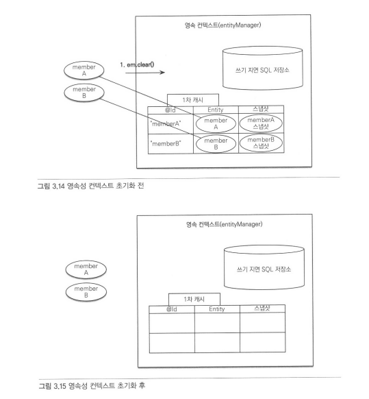

### 3.6.3 영속성 컨텍스트 종료 : close()
영속성 컨텍스트를 종료하면 해당 영속성 컨텍스트가 관리하던 영속 상태의 엔티티가 모두 준영속 상태가 된다.

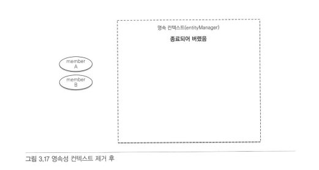

### 3.6.4 준영속 상태의 특징
* 거의 비영속 상태에 가깝다.<br>
영속성 컨텍스트가 제공하는 어떠한 기능도 동작하지 않는다.
* 식별자 값을 가지고 있다.<br>
* 지연 로딩을 할 수 없다.<br>
