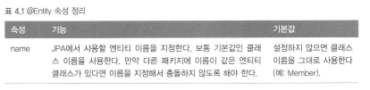
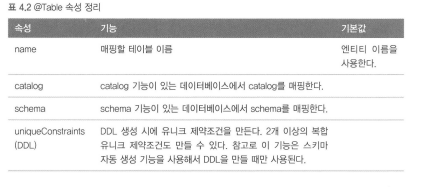

# 엔티티 매핑

## @entity

```
JPA를 사용햐서 테이블과 매핑할 클래스는 @Entity 어노테이션을 필수로 붙여야 한다.
@Entity가 붙은 클래스는 jpa가 관리하는 것으로 엔티티라고 부른다.
```



@Entity 적용 주의사항

* 기본 생성자는 필수다
* final 클래스, enum, interface, inner 클래스에는 사용할 수 없다.
* 저장할 필드에 final을 사용하면 안 된다.

## @Table

```
@Table은 엔티티와 매핑할 테이블을 지정한다.
```



## 데이터베이스 스키마 자동생성

```
JPA는 데이터베으스 스키마를 자동으로 생성하는 기능을 지원한다.
클래스의 매핑 정보를 보면 어떤 테이블에 어떤 컬럼을 사용하는지 알 수 있다.
```

## DDL 생성 기능

## 기본 키 매핑

JPA가 제공하는 데이터베이스 기본 키 생성 전략

* 직접 할당: 기본 키를 애플리케이션에서 직접 할당한다
* 자동 생성: 대리 키 사용 방식
  * IDENTITY : 기본 키 생성을 DB에 위임한다
  * SEQUENCE : DB 시퀀스를 사용해서 기본키를 할당한다.
  * TABLE : 키 생성 테이블을 사용한다.

기본 키를 직접 할당하려면 @ID만 사용하면 되고, 자동 생성 전략을 사용하려면 @ID에 @GeneratedValue를 추가하고 원하는 키 생성 전략을 선택하면 된다.

### 기본 키 직접 할당 전략

기본 키를 직접 할당하려면 @ID로 매핑하면 된다.
```JAVA

@Id
@Column(name = "id")
private String id;

```
기본 키 직접 할당 전략은 em.persist()로 엔티티를 저장하기 전에 애플리케이션에서 기본 키를 직접 할당하는 방법이다.


### IDENTITY 전략

IDENTITY는 기본 키 생성을 DB에 의임하는 전략이다.


