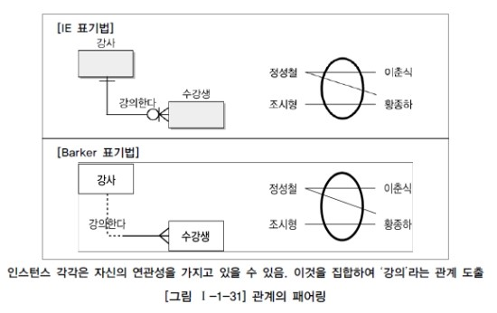
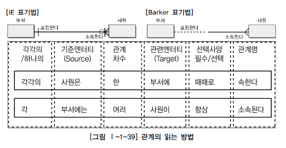

# 관계
>https://note.espriter.net/1353
>https://dataonair.or.kr/db-tech-reference/d-guide/sql/?mod=document&uid=328

## 1. 관계의 개념

### 가. 관계의 정의 

> 엔터티의 인스턴스 사이의 논리적인 연관성으로서 존재의 형태로서나 행위로서 서로에게 연관성이 부여된 상태

### 나. 관계의 페어링

페어링(pairing) : 각각의 엔터티의 인스턴스들이 자신이 관련된 인스턴스들과 관계의 어커런스로 참여하는 형태

엔티티 어커런스(Occurrence) : 정의된 레코드의 구조에 따라 데이터베이스에 구체적이고 실제적인 정보를 저장하고 있는 데이터 레코드, RDBMS에서는 듀플을 의미한다. 쉽게 말에 각 엔티티의 인스턴스의 각각의 데이터를 뜻한다.

엔터티는 인스턴스의 집합을 논리적으로 표현하였다면 관계는 관계 페어링의 집합을 논리적으로 표현한 것이다.

 
 

## 2. 관계의 분류

> 관계는 어떤 목적으로 연결되었느냐에 따라 **존재에 의한 관계**와 **행위에 의한 관계**로 구분될 수 있다.

 
 

## 3. 관계의 표기법

* 관계명(Membership) : 관계의 이름으로 관계에 참여하는 형태 지칭
* 관계차수(Cardinality) : 1:1, 1:M, M:N (수학적인 의미론 집합의 크기를 의미)
* 관계선택사양(Optionality) : 필수관계, 선택관계  예를 들어 지하철 출발과 지하철문 닫힘은 필수적으로 연결관계가 있는 것과 같이, 데이터 모델의 관계에서는 필수 참여 관계(Mandotory)가 됨. 반면 지하철 방송은 지하철 출발과 필수 참여 관계가 아닌 선택적 관계(Optional)이 됨

### 가. 관계명(Membership)
> 엔터티가 관계에 참여하는 형태를 지칭한다. 
> 각각의 관계는 두 개의 관계명을 가지고 있다.
> 또한 각각의 관계명에 의해 두 가지 관점으로 표현될 수 있다.

* 애매한 동사를 피한다. 예를 들면 ‘관계된다’, ‘관련이 있다’, ‘이다’, ‘한다’ 등은 구체적이지 않아 어떤 행위가 있는지 또는 두 참여자간 어떤 상태가 존재하는지 파악할 수 없다.
* 현재형으로 표현한다. 예를 들면 ‘수강을 신청했다’, ‘강의를 할 것이다’라는 식으로 표현해서는 안된다. ‘수강 신청한다’, ‘강의를 한다’로 표현해야 한다.

### 나. 관계차수(Degree/Cardinality)

> 두 개의 엔터티간 관계에서 참여자의 수를 표현하는 것을 관계차수(Degree/Cardinality)라고 한다. 가장 일반적인 관계차수 표현방법은 1:M, 1:1, M:N이다. 가장 중요하게 고려해야 할 사항은 한 개의 관계가 존재하느냐 아니면 두 개 이상의 멤버쉽이 존재하는지를 파악하는 것이 중요하다.

관계차수를 표시하는 방법은 여러 가지 방법이 있지만 Crow’s Foot 모델에서는 선을 이용하여 표현한다. 한 개가 참여하는 경우는 실선을 그대로 유지하고 다수가 참여한 경우는(Many) 까마귀발과 같은 모양으로 그려준다.

1. 1:1(ONE TO ONE) 관계를 표시하는 방법

> 관계에 참여하는 각각의 엔터티는 관계를 맺는 다른 엔터티의 엔터티에 대해 단지 하나의 관계만을 가지고 있다.

2. 1:M(ONE TO MANY) 관계를 표시하는 방법 

> 관계에 참여하는 각각의 엔터티는 관계를 맺는 다른 엔터티의 엔터티에 대해 하나나 그 이상의 수와 관계를 가지고 있다. 그러나 반대의 방향은 단지 하나만의 관계를 가지고 있다.

3. M:M(MANY TO MANY) 관계를 표시하는 방법
 

> 관계엔터티의 엔터티에 대해 하나나 그 이상의 수와 관계를 가지고 있다. 반대의 방향도 동일하게 관계에 참여하는 각각의 엔터티는 관계를 맺는 다른 엔터티의 엔터티에 대해 하나 또는 그 이상의 수와 관계를 가지고 있다. 이렇게 M:N 관계로 표현된 데이터 모델은 이후에 두 개의 주식별자를 상속받은 관계엔터티를 이용하여 3개의 엔터티로 구분하여 표현한다.

### 다. 관계선택사양(Optionality)

> 관계의 필수 선택여부에 의해 데이터 모델 관계에서는 선택참여관계(Optional)가 된다. 참여하는 엔터티가 항상 참여하는지 아니면 참여할 수도 있는지를 나타내는 방법이 필수참여(Mandatory Membership)와 선택참여(Optional Membership)이다.

필수참여는 참여하는 모든 참여자가 반드시 관계를 가지는, 타 엔터티의 참여자와 연결이 되어야 하는 관계이다.   예를 들면 주문서는 반드시 주문목록을 가져야 하며 주문목록이 없는 주문서는 의미가 없으므로 주문서와 주문목록은 필수참여관계가 되는 것이다.   반대로 목록은 주문이 될 수도 있고 주문이 되지 않은 목록이 있을 수도 있으므로 목록과 주문목록과의 관계는 선택참여(Optional Membership)가 되는 것이다.    선택참여된 항목은 물리속성에서 Foreign Key로 연결될 경우 Null을 허용할 수 있는 항목이 된다.    만약 선택참여로 지정해야 할 관계를 필수참여로 잘못 지정하면 애플리케이션에서 데이터가 발생할 때 반드시 한 개의 트랜잭션으로 제어해야 하는 제약사항이 발생한다. 그러므로 설계단계에서 필수참여와 선택참여는 개발시점에 업무 로직과 직접적으로 관련된 부분이므로 반드시 고려되어야 한다.  
선택참여관계는 ERD에서 관계를 나타내는 선에서 선택참여하는 엔터티 쪽을 원으로 표시한다. 필수참여는 아무런 표시를 하지 않는다.  

 > 만약 관계가 표시된 양쪽 엔터티에 모두 선택참여가 표시된다면, 즉 0:0(Zero to Zero)의 관계가 된다면 그 관계는 잘못될 확률이 많으므로 관계설정이 잘못되었는지를 검토해 보아야 한다. 
  
 

 
 

## 4. 관계의 정의 및 읽는 방법

### 가. 관계 체크사항
* 두 개의 엔터티 사이에 관심있는 연관규칙이 존재하는가?
* 두 개의 엔터티 사이에 정보의 조합이 발생되는가?
* 업무기술서, 장표에 관계연결에 대한 규칙이 서술되어 있는가?
* 업무기술서, 장표에 관계연결을 가능하게 하는 동사(Verb)가 있는가?

### 나. 관계 읽기
> 데이터 모델을 읽는 방법은 먼저 관계에 참여하는 기준 엔터티를 하나 또는 각(Each)으로 읽고 대상 엔터티의 개수(하나, 하나 이상)를 읽고 관계선택사양과 관계명을 읽도록 한다.

* 기준(Source) 엔터티를 한 개(One) 또는 각(Each)으로 읽는다.
* 대상(Target) 엔터티의 관계참여도 즉 개수(하나, 하나 이상)를 읽는다.
* 관계선택사양과 관계명을 읽는다.

 

위의 관계를 정의를 한 사항에 대해서 뒷부분만 의문문으로 만들면 바로 관계를 도출하기 위한 질문 문장으로 만들 수 있다.   위의 질문을 업무를 분석하는 자기 스스로에게 질문하거나, 장표나 업무기술서 또는 업무를 잘 알고 있는 업무담당 고객과 대화를 하면서 관계를 완성해 갈 수 있다. 예를 들어, 주문과 제품과 관계를 질문하기 원할 때 “한 주문에 대해서 하나의 제품만을 주문합니까?”라고 할 수도 있고 또는 “한 제품은 하나의 주문에 대해서만 주문을 접수받을 수 있습니까?”라고 질문할 수 있다.   이러한 질문 방법은 엔터티간 관계설정뿐 아니라 업무의 흐름도 분석이 되는 실제 프로젝트에서 효과적인 방법이 된다.