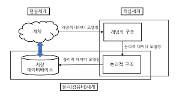

# 데이터 모델링의 이해
> 참고   1. https://wikidocs.net/1207   2. https://velog.io/@jihoson94/SQLD-%EB%8D%B0%EC%9D%B4%ED%84%B0-%EB%AA%A8%EB%8D%B8%EB%A7%81%EC%9D%98-%EC%9D%B4%ED%95%B4

## 1. 모델링의 이해

### 가. 모델링의 정의

>복잡한 현실세계를 일정한 표기법에 따라 표현하는 일

1. 복잡한 '현실세계' 를 <u>**단순화**</u>해 표현하는 것
1. 모델이란 사물 또는 사건에 관한 양상이나 관점을 연관된 사람이나 그룹을 위하여 <u>**명확하게**</u> 하는 것이다.
1. 모델이란 현실세계를 <u>**추상화한**</u> 반영이다.

### 나. 모델링의 특징
>위 정의에 따라 모델링은 추상화, 단순화, 명확화 특징을 가진다.

-  추상화는 현실세계를 일정한 형식에 맞추어 표현한다는 의미로 정리할 수있다. 즉 다양한 현상을 일정한 양식인 표기법에 따라 표현하는 것이다.

- 단순화는 복잡한 현실세계를 약속된 규약에 의해 제한된 표기법이나 언어로 표현하여 쉽게 이해할 수 있도록 하는 개념을 의미한다

- 명확화는 누구나 이해하기 쉽게 하기 위해 대상에 대한 애매모호함을 제거하고 정확하게 현상을 기술하는 것이다.

### 다. 모델링의 세 가지 관점
>모델링은 크게 데이터 관점, 프로세스 관점, 데이터와 프로세스의 상관 관점으로 구분할 수 있다.

-  데이터 관점 : 업무가 어떤 데이터와 관려ㅛㄴ이 있는지 또는 데이터 간의 관계는 무엇인지에 대해서 모델링하는 방법(What, Data)
-  프로세스 관점 : 실제하고 있는 업무는 무엇인지 또는 무엇을 해야 하는지를 모델링하는 방법(How, Process)
- 데이터와 프로세스의 상관 관점 : 업무가 처리하는 일의 방법에 따라 데이터는 어떻게 영향을 받고 있는지 모델링하는 방법(Interaction)

 
 

## 2.데이터 모델의 기본 개념 이해

### 가. 데이터 모델링의 정의
- 정보시스템을 구축하기 위한 데이터 관점의 업무 분석 기법
- 현실세계의 데이터에 대해 약속된 표기업에 의해 표현하는 과정
- 데이터베이스를 구축하기 위한 분석.설계의 과정

### 나. 데이터 모델이 제공하는 기능
1. 시스템을 현재 또는 원하는 모습으로 **가시화**하도록 도와준다.
1. 시스템의 구주와 행동을 **명세화**할 수 있게 해준다.
1. 시스템을 구축하는 **구조화한 틀**을 제공한다.
1. 시스템 구축 과정에서 결정한 것을 **문서화**한다.
1. 다양한 영역에 집중하기 위해 다른 영역의 세부 사항은 숨기는 다양한 관점을 제공한다.
1. 특정 목표에 따라 구체화한 상세 수준의 표현방법을 제공한다.

 
 

## 3. 데이터 모델링의 중요성과 유의점
> 데이터 모델링이 중요한 이유는 <u>파급효과(Leverage), 복잡한 정보 요구 사항의 간결한 표현(Conciseness), 데이터 품질(Data Qulity)</u>로 정리할 수 있다.

### 가. 파급효과
데이터 모델 변경 → 표준 영향 분석, 응용 변경 영향 분석 등 → 해당 분야의 실제적인 변경 작업→ 전체 시스템 구축 프로젝트에서 큰 위험요소

### 나. 북잡한 정보 요구 사항의 간결한 표현
데이터 모델은 구축할 시스템의 정보 요구 사항과 한계를 가장 명확하고 간결하게 표현할 수 있는 도구이다.

### 다. 데이터 품질
데이터 품질의 문제가 야기되는 중대한 이유 중 하나는 바로 "데이터 구조"의 문제이다.
중복 데이터의 미정의, 비즈니스 정의의 불충분, 동일한 성격의 데이터를 통합하지않고 분리함으로써 나타나는 데이터 불일치 등의 데이터 구조의 문제로 인한 데이터 품질의 문제는 치유하기에 불가능한 경우가 대부분이다.

1. 중복  
데이터 모델은 같은 데이터를 사용하는 사람, 시간, 장소를 파악하는 데 도움을 준다. 이러한 지식 응용은 데이터 베이스가 여러 장소에 같은 정보를 저장하는 잘못을 하지 않도록한다.
1. 비유연성 
데이터의 정의를 데이터의 사용 프로세스와 분리함으써 데이터 모델링은 데이터 혹은 프로세스의 작은 변화가 애플리케이션과 데이터베이스에 중대한 변화를 일으킬 수 있는 가능성을 줄인다.
1. 비일관성 
데이터의 중복이 없더라도 비일관성은 발생한다. 예를들어 신용 상태에 대한 갱신없이 고객의 납부 이력정보를 갱신하는 것입니다. 개발자가 다른 데이터와 모순된다는 고려없이 일련의 데이터를 수정할 수 있기 때문입니다. 데이터 모델링을 할 때 데이터와 데이터간의 상호연관관계에 대한 명확한 정의는 이러한 위험을 사전에 예방할 수 있게 해줍니다.

 
 

## 4. 데이터 모델링의 3단계 진행

 

|데이터 모델링| 내용 | 수준 |
|:---------:|:-----------------------------------------:|:----:|
|개념적 데이터 모델링| 추상화 수준이 높고 업무 중심적이고 포괄적 수준의 모델링 진행 전사적 데이터 모델링, EA수립 시 많이 이용 |추상적|
|논리적 데이터 모델링|시스템으로 구축하고자 하는 업무에 대해 KEY, 속성, 관계 등을 정확하게 표현, 재사용성이 높음 | 중간|
|물리적 데이터 모델링|실제로 데이터베이스에 이식할 수 있도록 성능,저장 등 물리적인 성격을 고려하여 설계 | 구체적|

### 가. 개념적 데이터 모델링
개념적 데이터베이스 설계는 조직, 사용자의 데이터 요구사항을 찾고 분석하는 데서 시작한다. 이 과정은 어떤 자료가 중요하고 또 어떤 자료가 유지되어야 하는지를 결정하는 것도 포함한다. 이 단계에서 중요한 활동은 핵심 엔터티와 그들 간의 관계를 발견하고, 그것을 표현하기 위해서 엔터티-관계 다이어그램을 생성하는 것이다. 엔터티-관계 다이어그램은 다양한 데이터베이스 사용자에게 어떤 데이터가 중요한지 나타내기 위해서 사용된다. 
 
데이터 모델링 과정이 전 조직에 걸쳐 이루어진다면, 그것은 전사적 데이터 모델(Enterprise Data Model)이라고 한다.
 
개념 데이터 모델을 통해 데이터 요구를 공식화하는 것은 두가자의 중요한 기능을 지원한다.
- 개념데이터 모델은 사용자와 시스템 개발자가 데이터 요구사항을 발견하는 것을 지원한다.
- 개념 데이터 모델은 현 시스템이 어떻게 변형되어야 하는가를 이애하는 데 유용하다.

### 나. 논리적 데이터 모델링
> 논리 데이터 모델링은 데이터베이스 설계 프로세시의 input으로서 비즈니스 정보의 논리적인 구조와 규칙을 명확하게 표현하는 기법 또는 과정이라 할 수 있다.

**논리 데이터 모델링의 결과로 얻게 되는 논리 데이터 모델은 데이터 모델링이 최종적으로 완료된 상태라고 정의할 수 있다.**

### 디. 물리적 데이터 모델링
> 물리 데이터 모델링은 논리 데이터 모델이 데이터 저장소로서 어떻게 컴퓨터 하드웨어에 표현될 것인가를 다룬다.

데이터가 물리적으로 컴퓨터에 어뗗게 저장될 것인가에 대한 정의를 물리적 스키마라고 한다.

## 데이터 모델링에서 데이터 독립성의 이해

### 가. 데이터 독립성의 필요성

1. 유지보수 비용증가
2. 데이터 복잡도 증가
3. 데이터 중복성 증가
4. 요구사항 대응 저하

> 데이터 독립성을 확보하면 다음과 같은 효과를 얻을 수 있다.   1. 각 뷰의 독립성을 유지하고 계층별 뷰에 영향을 주지 않고 변경할 수있다.   2. 단계별 스키마에 따라 데이터 정의어와 데이터 조작어가 다름을 제공한다.

 
 

### 나. 데이터베이스 3단계 구조

ANSI/SPARC의 3단계 구성의 데이터 독립성 모델은
외부 단계, 개념적 단계, 내부적 단계로 구성되어 있어 서로 간섭되지 않는 모델을 가지고 있다.

|항목|내용|비고|
|---------|-----------------------|------------|
|외부 스키마 |뷰 단계 여러 개의 사용자 관점으로 구성, 사용자 단계로서 사용자가 보는 개인적 DB스키마 | 사용자 관점 접근하는 특성에 따른 스키마 구성|
|개념스키마 | 하나의 개념적 스키마로 구성 모든 사용자 관점을 통합한 조직 전체 DB를 기술한것 모든 응용 시스템들이나 사용자들이 필요로 하는 데이터를 톱합한 조직 전체의 DB를 기술한 것, DB에 저장되는 데이터와 그들간의 관계를 표현한 스키마| 통합 관점|
| 내부 스키마 | DB가 물리적으로 저장된 형식, 물리적 장치에서 데이터가 실제적으로 저장되는 방법을 표현하는 스키마 | 물리적 저장구조|

> 데이터 베이스 스키마 구조는 3단계로 구분되고 각각은 상호 독립적인 의미와 고유한 기능을 하진다. 데이터 모델링은 통합 관점의 뷰를 갖는 개념 스키마를 만들어가는 과정으로 이해할 수 있다.

 
 

### 라. 두 영역의 데이터 독립성

|독립성|내용|특징|
|----------|------------------------------|-----|
|논리적 독립성| 개념 스키마가 변경되어도 외부 스키마에는 영향을 미치지 않도록 지원  논리적 구조가 변경되어도 응용 프로그램에 영향 없음 | 사용자 특성에 맞는 변경 가능  통합 구조 변경 가능 |
| 물리적 독립성 | 내부 스키마가 변경되어도 외부.개념 스키마는 영향을 받지 않도록 지원하는 것  저장장치의 구조변경은 응용 프로그램과 개념 스키마에 영향 없음 | 물리적 구조 영향 없이 개념구조 변경 가능  개념구조 영향 없이 물리적 구조 변경 가능|-

 
 

### 마. 사상

> 영어 'Mapping'은 우리말로 '사상'이라고 변역된다.
이것은 상호 독립적인 개념을 연결시켜주는 다리를 뜻한다.

|사상|내용|예|
|----------------|---------------------|-------|
|외부적개념적 사상 (논리적 사상)|외부적 뷰와 개념적 뷰의 상호 관련성을 정의함 | 사용자가 접근하는 형식에 따라 다른 타입의 필드를 가질 수 있음. 개념적 뷰의 필드 타입은 변화가 없음 |
| 개념적내부적사상 (물리적사상)|개념적 뷰와 저장된 데이터베이스의 상호 관련성을 정의함 | 데이터베이스 구조가 바뀐다면 개념적 내부적 사상이 바뀌어야함 그래야 개념적 스키마가 그대로 남아있음|

* 외부 화면이나 사용자에게 인터페이스하기 위한 스키마 구조는 전체가 통합된 개념적 스키마가 연결된다는 것이 논리적 사상
* 통합된 개념적 스키마 구조와 물리적으로 저장된 구조의 물리적 테이블 스페이스와 연결되는 구조가 물리적 사상

 
 

## 7. 데이터 모델링의 중요한 세 가지 개념

### 가. 데이터 모델링의 세 가지 요소

> 1. 업무가 관여하는 어떤 것(Things), 언테터 
> 2. 어떤 것이 가지는 성격(Attributes), 속성
> 3. 업무가 관여하는 어떤 것 간의 관계(Relationships), 관계

## 9. 데이터 모델의 표기법 ERD 이해

### 가. 데이터 모델 표기법

 
 

### 나. ERD 표기법으로 모델링하는 방법

> ERD(Entity Relationship Diagram)는 각 업무 분석에서 도출된 엔터티와 엔터티간의 관계를 이해하기 쉽게 도식화된 다이어그램으로 표시하는 방법이다.

 

#### 1. ERD 작업 순서

1. 엔터티를 그린다. 
2. 엔터티를 적절하게 배치한다.
3. 엔터티 간 관계를 설정한다
4. 관계명을 기술한다,
5. 관계의 참여도를 기술한다.
6. 관계의 필수여부를 기술한다.

 

#### 2. 엔터티 배치

가장 중요한 엔터티는 왼쪽 상단, 중앙에 배치한다.

고객, 주문 엔터티 핵심 배치

#### 3. ERD 관계의 연결

ERD 관계석서를 보고 서로 관련있는 엔터티간에 관계를 설정하도록 한다. 초기에는 모두 Primary Key로 속성이 상속되는 식별자 관계를 설정하도록 한다. 중복되는 관계가 발생되지 않도록 하고 Circle 관계도 발생하지 않도록 유의하여 작성하도록 한다.

#### 4. ERD 관계명의 표시

ERD 관계명의 표시 관계설정이 완료되면 연결된 관계에 관계이름을 부여하도록 한다. 관계이름은 현재형을 사용하고 지나치게 포괄적인 용어(예, 이다, 가진다 등)는 사용하지 않도록 한다.

#### 5. ERD 관계차수와 선택성 표시

ERD 관계 관계차수와 선택성 표시 관계에 대한 이름을 모두 지정하였으면 관계가 참여하는 성격 중 엔터티내에 인스턴스들이 얼마나 관계에 참여하는 지를 나타내는 관계차수(Cardinality)를 표현한다. [그림 Ⅰ-1-13]은 관계의 관계차수를 지정한 ERD의 모습을 보여준다. 관계설명에서도 언급하겠지만 IE표기법으로는 하나(1, One)의 관계는 실선으로 표기하고 Barker표기법으로는 점선과 실선을 혼합하여 표기한다. 다수참여(Many)의 관계는 까마귀발과 같은 모양으로 그려준다. 또한 관계의 필수/선택표시는 관계선에 원을 표현하여 ERD를 그리도록 한다.

## 10. 좋은 데이터 모델의 요소

> 1. 완전성
> 2. 중복 배제
> 3. 업무 규칙
> 4. 데이터 재사용
> 5. 의사소통
> 6. 통합송

### 가. 완전성
> 업무에 필요로 하는 모든 데이터가 데이터 모델에 정의 되어 있어야 한다.(Completeness)

### 나. 중복배제
> 하나의 데이터베이스 내에 동일한 사실은 반드시 한 번만 기록해야한다.(Non-Redundancy)

### 다. 업무규칙
> 데이터 모델링 과정에서 도출되는 수많은 업무 규칙을 데이터 모델이 표현하고 이를 해당 데이터 모델을 활용하는 모든 사용자가 공유할 수 있도록 제공한다

### 라. 데이터 재사용
> 데이터가 애플리케이션에 대해 독립적으로 설계되어야만 데이터 재사용을 높일 수 있다.

### 마. 의사소통
> 많은 업무 규칙들은 데이터 모델에 엔터티, 서브타입, 속성, 관계 등의 형태로 최대한 자세하게 표현되어야 한다.

### 바. 통합성
>가장 바람직한 데이터 구조의 형태는 동일한 데이터는 조직 전체에서 한 번만 정의되고 이를 여러 다른 영역에서 참조.활용하는 것이다.(Intergration)