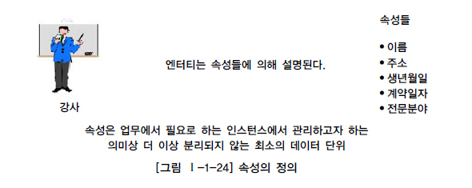
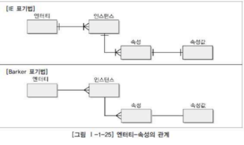
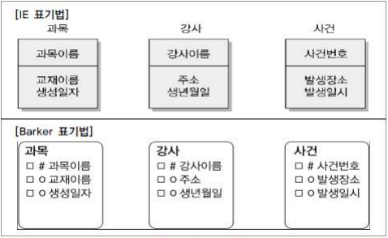
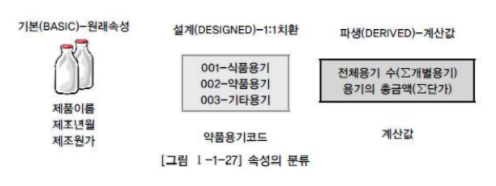
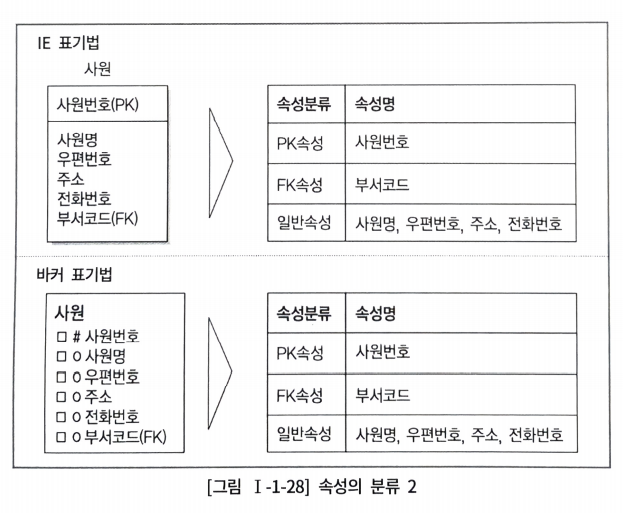

# 속성
>https://note.espriter.net/1353

## 1. 속성의 개념

> 업무에서 필요로 하는 인스턴스로 관리하고자 하는 의미상 더시상 분리할 수 없는 최소의 데이터 단위 
> 업무상 관리하기 위한 최소의 의미 단위

 

* 업무에서 필요로 한다
* 의미상 더 이상 분리되지 않는다.
* 엔터티를 설명하고 인스턴스의 구성요소가 된다.

 
 

## 2. 엔터티, 인스턴스와 속성, 속성값에 대한 내용과 표기법

### 가. 엔터티, 인스턴스, 속성, 속성값의 관계

* 한 개의 엔터티는 2개 이상의 인스턴스 집합
* 한 개의 엔터티는 2개 이상의 속성을 가짐
* 한 개의 속성은 1개의 속성값 (value)을 가짐

### 나. 속성의 표기법

속성의 표기법은 엔터티 내에 이름을 포함하여 표현한다.

 
 

## 3. 속성의 특징

* 엔터티와 마찬가지로 반드시 해당 업무에서 필요,관리하고자 하는 정보이어야 한다.

* 정규화 이론에 근간하여 정해진 주식별자에 함수적 종속성을 가져야 한다.

* 하나의 속성에는 한 개의 값만을 가진다. (하나의 속성에 여러 개의 값이 있는 다중값일 경우 별도의 엔터티를 이용하여 분리한다.)

 
 

## 4. 속성의 분류

### 가. 속성의 특성에 따른 분류

> 기본속성(Basic Attribute), 설계속성(Designed Attibute), 파생속성(Derived Attribute)이 있다.

* 기본속성  
업무로부터 추출한 모든 속성이 여기에 해당된다.

* 설계속성  
기본속성 외에 새롭게 만들거나 변형하여 정의한 속성

* 파생속성  
타 속성에 의해 지속적으로 영향을 받아 값이 변하는 성질을 가지고 있는 속성 
파생속성은 그 속성이 가지고 있는 계산방법에 대해 반드시 어떤 엔터티에 어떤 속성에 의해 영향을 받는지 정의가 되어야 한다. 
파생속성은 꼭 필요한 경우에만 정의하여 업무로직이 속성내부로 스며들지 못하도록 주의해야 한다. 
파생속성을 정의한 경우라면 그 값의 정합성을 유지할 수 있도록 해야 한다. 
주로 통계관련 엔터티, 배치작업 수행 관련에 사용된다.

### 나. 엔터티 구성 방식에 따른 분류

> * 엔터티를 식별할 수 있는 속성을 PK(Primary Key) 속성,
> * 다른 엔터티와의 관계에서 포함된 속성을 FK(Foreign Key) 속성
> * 엔터티에 포함되어 있고, PF,FK에 미포함 속성을 일반 속성
> * 속성은 그 안에 세부 의미를 쪼갤 수 있는지에 따라 복합형으로 분류할 수 있다.
>  시·구·동·번지 같은 여러 세부 속성들로 구성될 수 있을 경우 복합속성이라 한다.  
> 나이, 성별 등의 더이상 다른 속성들로 구성될 수 없는 경우 단순속성이라 한다.

## 5. 도메인

> 각 속성은 가질 수 있는 값의 범위를 도메인이라 한다. 
> ex) 학생이라는 엔터티가 있을 때 학점 속성의 도메인은 0.애서 4.0 사이의 실수 값이며, 주소 속성은 길이가 20자 이내인 문자열로 정의할 수 있다. 
> 각 속성은 도메인 이외의 값을 갖지 못한다. 
> 엔터티 내에서 속성에 대한 데이터타입과 크기·제약사항을 지정하는것이다.

## 6. 속성의 명명

* 현업에서 사용하는 이름을 부여하는 것이 가장 중요하다
* 속성명은 서술식으로 지정하면 안된다.
* 공용화되지 않은 업무에서 사용하지 않는 약어는 사용하지 않는 것이 좋다.
* 가능하면 모든 속성의 이름은 유일하게 작성하는 것이 좋다.

