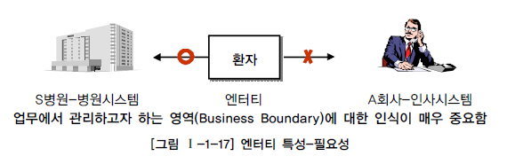

# 엔터티

## 1. 엔터티의 개념

> * 엔터티는 사람, 장소, 물건, 사건, 개념 등의 명사에 해당한다.
> * 엔터티는 업무상 관리가 필요한 관심사에 해당한다.
> * 엔터티는 저장이 되기 위한 어떤 것(thing)이다.
>  
> => 업무에 필요하고 유용한 정보를 저장하고 관리하기 위한 집합적인 것(thing)

## 2. 엔터티와 인스턴스에 대한 내용과 표기법

과목,강사,사건은 엔터티에 해당하며 수학,영어는 과목이라는 엔터티의 인스턴스이고 이춘식, 조시형은 강사라는 엔터티의 인스턴스이며 사건번호인 2010-001, 2010-002는 사건 엔터티에 대한 인스턴스이다.

## 3. 엔터티의 특징

> * 반드시 해당 업무에서 필요하고 관리하고자 하는 정보
> * 유일한 식별자에 의해 식별이 가능해야 한다
> * 영속적으로 존재하는 인스턴스의 집합이어야 한다.
> * 엔터티는 업무 프로세스에 의해 이용되야 한다.
> * 엔터티는 반드시 속성이 있어야 한다.
> * 엔터티는 다른 엔터티와 최소 한 개 이상의 관계가 있어야 한다.

### 가. 업무에서 필요로 하는 정보

엔터티를 도출할 때는 업무 영역에서 관리할 필요가 있는지를 먼저 판단해야 한다.

### 나. 식별 가능해야.

유일한 식별자에 의해 인스턴스를 식별할 수 있어야 한다.

### 다. 인스턴스의 집합

영속적으로 존재하는 인스턴스의 집합이 되어야 한다.
'한 개'가 아니라 '두 개 이상'의 인스턴스 집합이어야 한다.

### 라. 업무 프로세스에 의해 이용되야 한다

업무 프로세스가 해당 엔터티를 반드시 이용해야 한다.

### 마. 속성 포함

엔터티에는 반드시 속성이 포함되야 한다.
또한 주식별자만 존재하고 일반속성은 전혀 없는 경우도 마찬가지로 적절한 엔터티라고 할 수 없다. 
단 예외적으로 관계 엔터티는 주식별자 속성만 가지고 있어도 엔터티로 인정한다.

## 바. 관계의 존재
엔터티는 다른 엔터티와 최소 한 개 이상의 관계를 가져야 한다.

 
 

## 4. 엔터티의 부류

엔터티는 엔터티 자신의 성격에 의해 실체 유형에 따라 구분하거나 업무를 구성하는 모습에 따라 구분이 되는 발생 시점에 의해 분류할 수 있다.

### 가. 유무형에 따른 분류

> 유형엔터티, 개념엔터티, 사건엔터티로 구분된다.

*  유형엔터티(Tangibleentity) : 물리저인 형태가 있고 안정적이며 지속적으로 활용되는 엔터티 ex) 사원, 물품, 강사 등

* 개념 엔터티(Conceptual Entity) : 물리적인 형태는 존재하지 않고 관리해야 할 개념적 정보로 구분되는  엔터티 ex) 조직, 보험상품 등 

* 사건 엔터티(Event Entity) : 업무를 수행함에 따라 발생하는 엔터티 비교적 발생량이 많으며 각종 통계자료에 이용된다. ex) 주문, 청구, 미납 등

### 나. 발생시점에 따른 분류

> 기본엔터티, 중심엔터티, 행위엔터티로 구분된다.

* 기본엔터티 : 업무에 원래 존재하는 정보로서 다른 엔터티와 관계에 의해 생성되지 않고 독립적으로 생성이 가능하며 자신은 타 엔터티의 부모 역할을 한다.
다른 엔터티로부터 주식별자를 상속받지 않고 자신의 고유한 주식별자를 가지게 된다.
ex) 사원, 부서, 고객, 상품, 자재 등

* 중심엔터티 : 기본엔터티로부터 발생되고 그 업무에서 중심적인 역활을 한다. 데이터의 양이 많고 다른 엔터티와의 관계를 통해 많은 행위 엔터티를 생성한다.
ex) 계약, 사고, 예금원장, 청구, 주문, 매출

* 행위엔터티 : 두 개 이상의 부모엔터티로부터 발생하고, 자주 내용이 바뀌거나데이터 양이 증가한다.
분석 초기에는 잘 나타나지 않으며, 사에 설계 단계나 프로세스와 상관모델링을 진행하면서 도출된다.
ex) 주문목록, 사원변경이력 등

 

## 5. 엔터티의 명명

1. 현업업무에서 사용하는 용어를 사용한다.
1. 약어를 사용하지 않는다.
1. 단수명사를 사용한다.
1. 모든 엔터티에서 유일하게이름이 부여되어야 한다.
1. 엔터티 생성 의미대로 이름을 부여한다.
