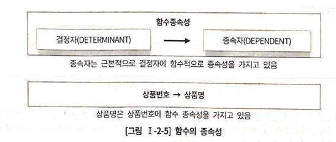

# 졍규화
>http://www.gurubee.net/wiki/pages/33751579
>https://dataonair.or.kr/db-tech-reference/d-guide/sql/?pageid=5&mod=document&uid=333

## 1. 제1정규형 : 모든속성은 반드시 하나의 값을 가져야 한다.

> 제 1져유형은 하나의 속성에는 하나의 값을 가져야 한다.

해당 이미지와 같이 데이터가 생성될 경우

* 연락처 정보에서 집전화 번호와 핸드폰 번호를 구별하기가 어렵다.
* A고객은집전화가 여러 대고, B고객은 핸드폰이 여러 대라면 원하는 속성 값을 추출하기 어렵다.
* 명확하지 않은 속성은 이메일처럼 다른 유형의데이터를 포함할 수도 잉 속성의 의미가 퇴색될 수 있다.

고객전하번호라는 엔터티를 추가하여 다중 값에 대한 문제점을 해결할수 있다.

해당 표를 보면 고객의 연락처가 많아져도 아무런 문제가 발생하지 않는다.
 

제 1저규형은 다중 값 말고도 다른 유형의 중복 데이터도 의미 한다.

해당 그림처럼 엔터티 생성시 아래와 같은 문제가 발생한다.

* 상품을 3개 이상 주문할 수 없다.
* 상품1, 상품2 모두 빠르게 조회하고 싶다면 속성마다 인덱스를 추가해야 한다.

 

해당 엔터티에서 상품을 2개까지만 주문 할 수 있다. 3개 이상 상품을 주문하고 싶을 경우 상품번호N, 상품명N의 속성을 추가해야 한다.
 

해당 문제를 해결하기 위해서는 아래 이미지와 같이 주문상세 엔터티를 추가하면 된다.

 
 

## 2. 제2정규형 : 엔터티의 일반속성은 주식별자 전체에 종속적이어야 한다.

해당 그림의 주문상세 엔터티에서 '상품명'속성이 주식별자(주문번호 + 상품번호)가 아닌 '상품번호'에 대해서만 종속적이다.

* 함수종속성(Functional Dependency) : 데이터들이 어떤 기준값에 의해 종속되는 현상  
ex)상품명은 상품번호에 함수 종속성을 가지고 있다.

* 결정자(Determinant) : 함수종속성중에서 기준이 되는 속성  
ex) 상품번호가 결정자에 해당된다.

* 종속자(Dependent) : 함수종속성중에서 종속되는 속성  
ex) 상품명이 종속자에 해당된다.

> 제 2 졍규형이란 <U> 엔터티의 일반속성은 주식별자 전체에 종속적이어야한다.</U>  
> 제2정규형위배란 주식별자 전체에 종속적이지 않고 식별자 일부에만 종속적인 경우를 말한다.(부분종속)

 

그림과 같이 상품 엔터티를 추가하여 주문상세 엔터티의 부분 종속성을 제거하여 '일반속성은 주식별자 전체에 종속해야 한다.'는 제2정규형을 만족시킨다.

 
 

## 3. 제3정규형 : 엔터티의 일반속성 간에는 서로 종속적이지 않는다.

해당 그림의 주문엔터티를 보면 고객번호는 주문번호에 종속적이고, 고객명은 고객번호에 종속적이다. 이는 '고객명이 주문번호에 종속적임'을 의미한다. 이것을 <Strong>이행적 종속(Transitive Dependecy)라고 한다.</Strong>

주문엔터티는 고객번호와 고객명 모두 주문번호에 조옥하여 제2정규형은 만족하였으나, 고객명이 식별자가 아닌 일바녹성에 종속적인 제3정규형 위배에 해당한다.

제3정규형을 하기 위해서는 고객번호,고객명을 가진 별도의 엔터티를 생성한다.

> 정규화는 필수적이지만 무조건적이지는 않다. 상황에 따라서는 반정규화를 진행해야할 수 있다. 
> 그렇다고 정규화를 진행안하는 것이 아니라 반드시 
> 정규화를 진행한 이후에 반정규화를 진행해야만 한다.

 
 

## 4. 반정규화와 성능

### 가. 반정규화의 정의

반정규화(=역정규화) 용어는 조금 다르게 표현되어도 그 의미는 동일하다. 여기에서 반정규화는 ‘반(Half)’의 의미가 아닌 한자로 반대하다의 의미를 가진 ‘反’의 의미이다. 영어로는 De-Normalization이다. 비정규화는 아예 정규화를 수행하지 않은 모델을 지칭할 때 사용한다.  
반정규화를 정의하면 정규화된 엔터티, 속성, 관계에 대해 시스템의 성능향상과 개발(Development)과 운영(Maintenance)의 단순화를 위해 중복, 통합, 분리 등을 수행하는 데이터 모델링의 기법을 의미한다. 협의의 반정규화는 데이터를 중복하여 성능을 향상시키기 위한 기법이라고 정의할 수 있고 좀 더 넓은 의미의 반정규화는 성능을 향상시키기 위해 정규화된 데이터 모델에서 중복, 통합, 분리 등을 수행하는 모든 과정을 의미한다.  
데이터 무결성이 깨질 수 있는 위험을 무릅쓰고 데이터를 중복하여 반정규화를 적용하는 이유는 데이터를 조회할 때 디스크 I/O량이 많아서 성능이 저하되거나 경로가 너무 멀어 조인으로 인한 성능저하가 예상되거나 칼럼을 계산하여 읽을 때 성능이 저하될 것이 예상되는 경우 반정규화를 수행하게 된다.  

기본적으로 정규화는 입력/수정/삭제에 대한 성능을 향상시킬 뿐만 아니라 조회에 대해서도 성능을 향상시키는 역할을 한다.   그러나 정규화만을 수행하면 엔터티의 갯수가 증가하고 관계가 많아져 일부 여러 개의 조인이 걸려야만 데이터를 가져오는 경우가 있다.   이러한 경우 업무적으로 조회에 대한 처리성능이 중요하다고 판단될 때 부분적으로 반정규화를 고려하게 되는 것이다.  또한 정규화의 함수적 종속관계는 위반하지 않지만 데이터의 중복성을 증가시켜야만 데이터조회의 성능을 향상시키는 경우가 있다.  이러한 경우 반정규화를 통해서 성능을 향상시킬 수 있게 되는 것이다.

 
 

### 나. 반정규화를 적용한 모델에서 성능이 향상될 수 있는 경우

해당  ERD에서 고객번호가 1234인 고객의 주문정보를 결제 테이블과 조인 후, 신용카드 결제 정보를 결제일시로 최근 1건의 결제수단번호를 가져오는 SQL문이다. 
주문이 몇건 없을때는 상관없지만 주문이 많을 수록 성능이 나빠지는 문제가 발생한다. 이러한 문제가 생길 경우 아래 이미지와 같이 반정규화를 진행하여 해당 문제를 해결할 수 있다.

> 결제 엔터티에 고객번호 속성을 추가하는 반정규화를 진행하였다.

결제 테이블에 고객번호 + 결제수단구분코드+결제일시로 인덱스 생성하고 최종 1건의 데이터만 읽어 결제수단번호를 가져올 수 있다.
