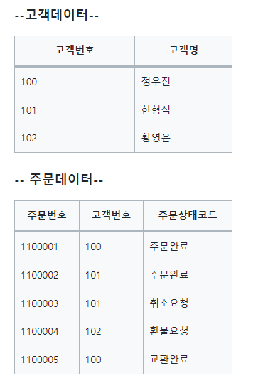
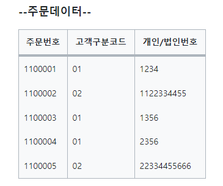

# 관계와 조인의 이해
>https://note.espriter.net/1354
>https://velog.io/@i_am_heeeun/SQL-%EB%AA%A8%EB%8D%B8%EC%9D%B4-%ED%91%9C%ED%98%84%ED%95%98%EB%8A%94-%ED%8A%B8%EB%9E%9C%EC%9E%AD%EC%85%98%EC%9D%98-%EC%9D%B4%ED%95%B4

* 관계란 부모의 식별자를 자식에게 상속시키는 행위이다. 
* 부모식별자를 자식 식별자에 포함하면 식별 관계
* 부모식별자를 자식 일반속성으로 상속하면 비식별관계

> 즉 관계를 맺는다는건 식별자를 상속하고, 상속된 속성을 매핀키로 활용하여 데이터를 결합한다는 의미이다.
이를 SQL에서는 JOIN이라 한다.

<BR>

## 1. 조인


위의 모델은 고객과 주문엔터티가 관계를 맺고 있는 모습이다.

관계를 맺음으로 생기는 현상은 고객 엔터티의 식별자인 고객번호를 주문엔터티에 상속시킨 것이다. <BR> 즉 관계를 맺는다는 것은 식별자를 상속시키고 해당 식별자를 매핑키로 활용해 데이터를 결합하여 보겠다는 것이다.

> 고객과 주문 데이터


위 표의 주문데이터의 고객데이터에서 고객번호를 상속시킨 것을 볼 수 있다.

주문번호가 1100001인 주문의 고객명은 정우진이라는 것을 알수있다. 우리는 어떻게 고객명을 알수 있었을까? 이를 풀어보면 다음과 같다.

> * 주문데이터에서 주문번호가 1100001인 데이터를 찾는다.
>
> * 주문번호가 1100001 데이터의 행에서 고객번호가 100임을 확인한다.
>
>* 고객데이터에서 고객번호가 100인 데이터를 찾는다.
>
>* 고객번호가 100인 데이터의 행에서 고객명인 정우진이라는 것을 확인한다.

위와 같은 순서로 고객명을 찾았다. <BR>
이것이 바로 관계를 활용한 조인이다.<BR>
관계에 의해 상속된 고객번호라는 속성을 가지고 주문데이터에서 매핑키로써 고객명을 찾아냈다.<BR> 두번째와 세번째가 조인이고 고객번호가 조인키이다.<BR> 이것을 SQL로 작성해본다면 다음과 같다.

```
SELECT B.고객명
  FROM 주문 A, 고객 B
 WHERE A.주문번호 = '1100001'
   AND A.고객번호 = B.고객번호
```

<BR>
<BR>

## 2. 계층형 모델


> 계층형 데이터 모델이란 <BR>
: 말 그대로 계층구조를 가진 데이터를 지칭하는 것이다.


위 표에서 주목해야 할 속성은 MGR이다. MGR속성은 각 사원 관리자의 사원번호를 의미한다. 즉 SMITH의 관리자는 사원번호가 7902인 FORD가 된다. 그럼 FORD의 관리자는 누구일까 사원번호가 7566인 JONES이다. 관리자를 찾아가는 과정이 조인이라는 행동이다. 이를 SQL로 표현하면 다음과 같다.

```
SELECT B.EMANE
  FROM EMP A, EMP B
 WHERE A.ENAME='SMITH'
   AND A.MGR=B.EMPNO
```

이전과 다른점은 자기자신을 조인했다는 것이다. 이를 셀프조인이라고한다.

> 즉 계층형 데이터 모델은 데이터 간의 계층이 존재할 때 발생하는 모델이라 할 수 있다.


데이터를 더 직관적으로 표현하면 다음과 같다.


<BR>
<BR>

## 3. 상호배타적 관계

>상호배타적 이란  <BR>
>한 사건이 발생하면 다른 사건이 일어날 수 없을 때 이 두 사건을 상호배타적이라고 한다. 한 사건이 발생하면 다른 사건이 일어날 수 없을 때 이 두 사건을 상호배타적이라고 한다.

<BR>
<BR>

>개인, 법인고객이 존재하는 모델에서 주문과의 상호배타적 관계를 표현하고 있다.


본 모델에서는 관계의 배타적관계로서 주문엔터티에는 개인 또는 법인번호 둘중 하나만 상속될 수 있음을 의미한다. 즉 주문은 개인고객이거나 법인고객 둘중 하나의 고객만이 가능하다



위 표의 주문데이터를 보면 개인/법인번호는 개인고객 또는 법인고객의 식별자가 상속된 값이다. 이때 고객구분코드의 값을 통해 개인고객의 식별자가 상속되었는지, 법인고객의 식별자가 상속되었는지를 나타낸다.

```

-- 주문번호가 1100001인 주문의 주문자명을 확인하고 싶을때

SELECT B.개인고객명
  FROM 주문 A, 개인고객 B
 WHERE A.주문번호=1100001
   AND A.고객구분코드='01'
   AND A.개인/법인번호=B.개인번호
 UNION ALL
SELECT B.법인명
  FROM 주문 A, 법인고객 B
 WHERE A.주문번호=1100001
   AND A.고객구분코드='02'
   AND A.개인/법인번호=B.법인번호

SELECT COALESCE(B.개인고객명, C.법인명) 고객명
  FROM 주문 A 
  LEFT JOIN 개인고객B
    ON (A.개인/법인번호=B.개인번호)
  LEFT OUTER JOIN 법인고객 C
    ON (A.개인.법인번호=C.법인번호)
 WHERE A.주문번호=1100001;


```