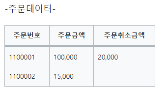
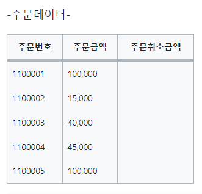

# 2_4 Null 속성의 이해
>https://velog.io/@i_am_heeeun/SQL-NULL%EC%86%8D%EC%84%B1%EC%9D%98-%EC%9D%B4%ED%95%B4


## 1. Null 값의 연산은 언제나 Null이다.

> Null값은 공백이나 숫자0과는 전혀 다른 의미이다. <br> 아직 정의되지 않은 미지의 값 또는 현재 데이터를 입력하지 못하는 경우를 의미한다. 즉 Null은 값이 존재하지 않음을 말한다.



```
SELECT 주문금액-주문취소금액 COL1
	 , NVL(주문금액-주문취소금액,0) COL2
     , NVL(주문금액,0)-NVL(주문취소금액,0) COL3
  FROM 주문

결과
 COL1	 COL2	 COL3
80,000	80,000	80,000
  null       0	15,000

```

Null값의 연산은 언제나 Null이기 때문에 연산이 불가능하다.
그렇기에 <Strong> Null값이 들어간 연산은 언제나 Null을 결과로 반환한다. </Strong>
<BR>Null값으로 가능한 연산은 IS NULL, IS NOT NULL 밖에 없다.

```
주문금액-주문취소금액 COL1

COL1은 Null값을 전혀고려하고 있지 않다.
그로 인해 첫번째 행은 정상적으로 데이터가 나오지만 Null값이 존재하는 두 번째 행의 결과는 Null값을 반환한다.
```

```
NVL(주문금액-주문취소금액,0) COL2

COL2는 주문금액에서 주문취소금액을 제외한 결과에 대해 NVL처리를 하였다. 마찬가지로 첫번째 행은 정상적으로 데이터가 나오지만 
두번째 행은  NULL값이 들어가 연산값이 NULL이 나오고 NVL로 인하여 '0'이 나온다.
```

```
NVL(주문금액,0)-NVL(주문취소금액,0) COL3

각 속성별로 NVL처리 진행 후 주문금액에서 주문최소금액을 제외하였다.
 마찬가지로 첫번째 행은 정상적으로 데이터가 나오며 두번째 행또한 NVL함수로 인해 NULL값이 '0'으로 나와 '15,000 - 0'연산이 실행되어 15,000 결과값이 제대로 나온다.
```

<BR>
<BR>

## 2. 집계함수는 Null값을 제외하고 처리한다.



```
SELECT SUM(주문금액) - SUM(주문취소금액) COL1
	 , NVL(SUM(주문금액-주문취소금액),0) COL2
     , NVL(SUM(주문금액),0) - NVL(SUM(주문취소금액),0) COL3
  FROM 주문

결과
COL1	COL2	COL3
NULL      0	   300,000

결과값이 전부 상이하게 노출되고 있다.
```

```
SUM(주문금액) - SUM(주문취소금액) COL1

주문취소금액은 한 건도 존재하지 않기에 주문금액과 주문취소금액  합산한 결과는 NULL이다.
```

```
NVL(SUM(주문금액-주문취소금액),0) COL2

주문취소금액은 한 건도 존재하지 않기에 주문금액과 주문취소금액 합산한 결과는 NULL이지만
NVL함수를 사용함으로 인해 '0'이 도출된다.
```

```
NVL(SUM(주문금액),0) - NVL(SUM(주문취소금액),0) COL3

주문취소금액은 한 건도 존재하지 않지만 주문금액과 연산하기 전에 NVL로 '0'을 도출시킨다. 그로인해 주문금액과 주문취소금액의 연산이 정상적으로 가능해진다.
```


