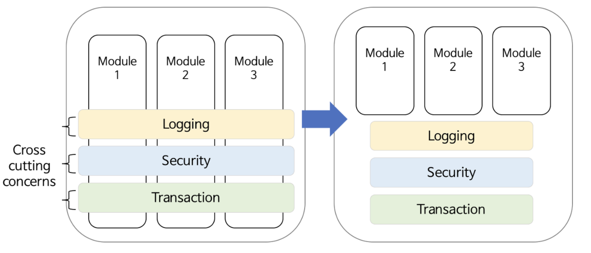
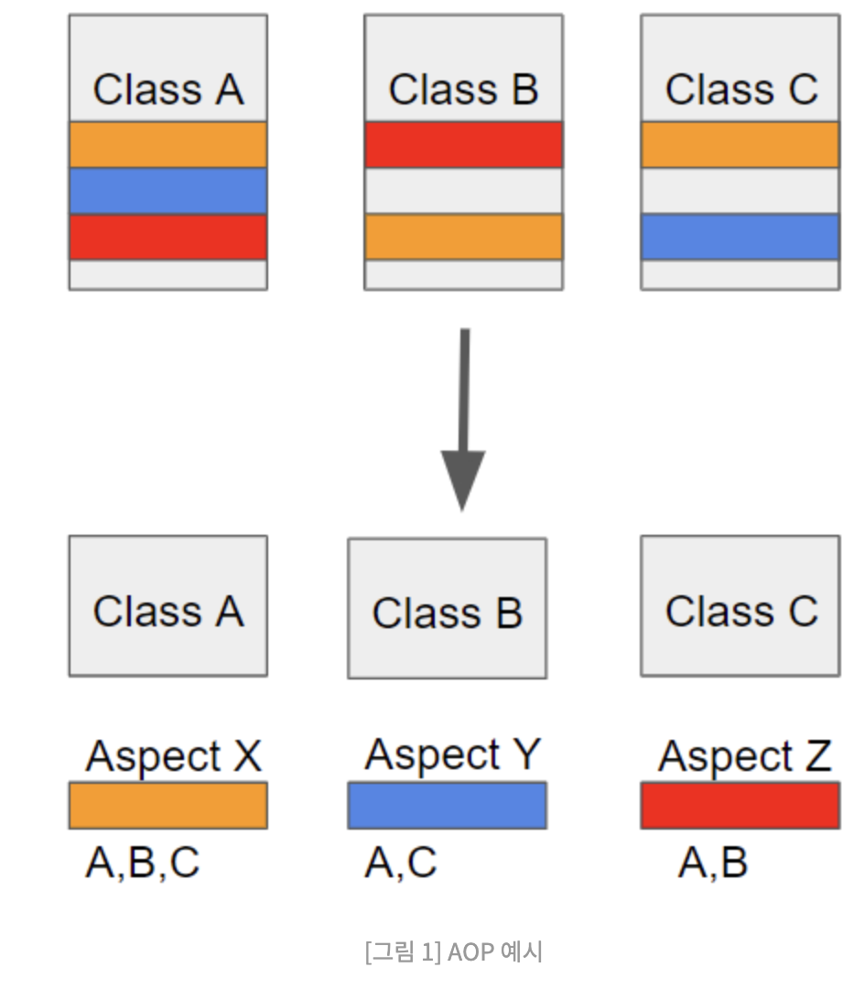

# 단일책임원칙(Single Responsibility Principle SRP)

> 객체는 단 하나의 책임(기능 담당)만 가져야 한다. 
> 객체는 책임에 수반되는 모든 일을 자신만이 수행할 수 있어야 한다.

단일 책임 원칙 준수 유무에 따른 가장 큰 특징 기준 척도는, '기능 변경(수정)' 이 일어났을때의 파급 효과 이다.

## 책임 분리

한 객체에 책임이 많아질수록 클래스 내부에서 서로 다른 역할을 수행하는 코드끼리 강하게 결합될 가능성이 높아지게 되어 시스템이 복잡해질 수 있다. 그래서 그 객체가 하는 기능에 변경사항이 생기면 이 기능을 사용하는 부분의 코드를 모두 다시 테스트를 해야 할 수도 있다.

예를 들어 A를 고쳤더니 B를 수정해야하고 또 C를 수정해야하고, C를 수정했더니 다시 A로 돌아가서 수정해야 하는, 마치 책임이 순환되는 형태를 들 수 있다.

이 처럼 책임이 이것저것 포함된 클래스는 한 책임의 변경에서 다른 책임의 변경으로의 연쇄작용이 일어 나게 된다. (회귀 테스트)

## 산탄총 수술

> 하나의 책임이 여러개의 클래스들로 분산되어 있는 경우에도 단일 책임 원칙에 입각해 설계를 변경해야 할 경우

여러 개의 클래스에 책임(기능)이 분산된 경우 클래스 하나하나를 모두 변경하지 않으면 프로그램이 정상적으로 동작하지 않고 에러가 발생한다.

하나의 책임(기능)이 여러 개의 클래스로 분리되어 있는 예로는 로깅, 보안, 트랜잭션과 같은 횡단 관심으로 분류할 수 있는 기능이 대표적이다.

## 횡단관심

횡단관심 문제를 해결하는 방법으로는 관심지향 프로그래밍(Aspect Oriented Programming AOP)기법이 있다.  

AOP는 횡단관심을 수해아는 코드를 애스펙트라는 특별한 객체로 모듈화하고 위빙이라는 작업을 통해 모듈화한 코드를 핵심 기능에 끼워넣을 수 있다.  

> AOP는 흩어진 관심사(Crosscutting Concerns)를 모듈화 할 수 있는 프로그래밍 기법이다
> 
> 결국 AOP에서 각 관점을 기준으로 로직을 모듈화한다는 것은 흩어진 관심사를 모듈화하겠다는 의미다. 그림과 같이 주황색, 파란색, 빨간색 블록처럼 모듈화 시켜놓고 어디에 적용시킬지만 정의해주면 되는 것이다. 이때 모듈화 시켜놓은 블럭을 Aspect라고 한다. 

