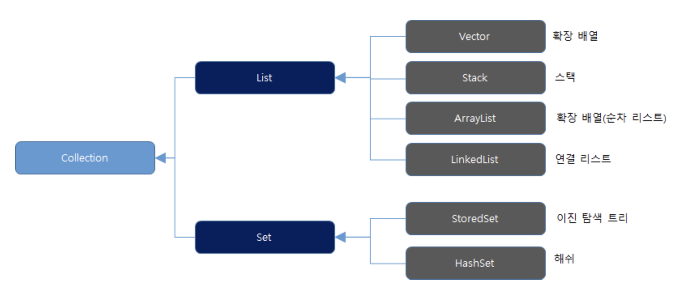

# 리스코프 치환 원칙

자식 클래스는 최소한 자신의 부모 클래스에서 가능한 행위는 수행이 보장되어야 한다.

즉, 부모 클래스의 인스턴스를 사용하는 위치에 자식 클래스의 인스턴스를 대신 사용했을 때 코드가 원래 의도대로 작동해야 한다는 의미이다.

이것을 부모 클래스와 자식 클래스 사이의 행위가 일관성이 있다고 말한다.

> LSP 원칙을 잘 적용한 얘제가 자바의 컬렉션 프레임워크(Collection Framework) 이다. 
만일 변수에 LinkedList 자료형을 담아 사용하다, 중간에 전혀 다른 HashSet 자료형으로 바꿔도 add() 메서드 동작을 보장받기 위해서는 Collection 이라는 인터페이스 타입으로 변수를 선언하여 할당하면 된다. 
왜냐하면 인터페이스 Collection의 추상 메서드를 각기 하위 자료형 클래스에서 implements하여 인터페이스 구현 규약을 잘 지키도록 미리 잘 설계되어 있기 때문이다.

