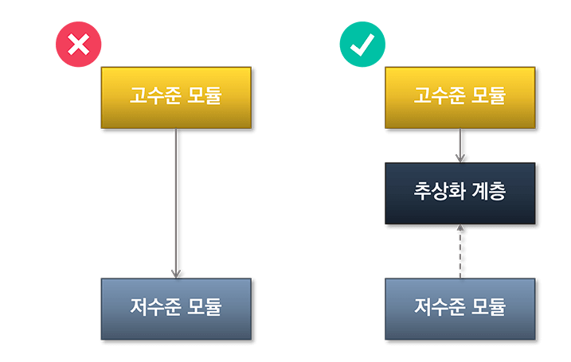
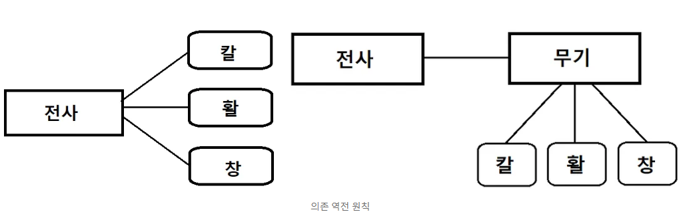

# 의존 역전 원칙(Dependency Inversion Principle)

> https://kotlinworld.com/64

> 의존관계 역전 원칙이란 "추상화에 의존해야지, 구체화에 의존하면 안 된다" 는 원칙입니다.

DIP를 만족하려면 어떤 클래스가 도움을 받을 때 구체적인 클래스보다는 인터페이스나 추상 클래스와 의존 관계를 맺도록 설계해야 한다.

고수준 모듈 : 어떤 의미 있는 단일 기능을 제공하는 모듈 (interface, 추상 클래스)  
저수준 모듈 : 고수준 모듈의 기능을 구현하기 위해 필요한 하위 기능의 실제 구현 (메인클래스, 객체)

> 의존성 역전 원칙이란 객체는 구체적인 객체가 아닌 추상화에 의존해야 한다는 법칙입니다. 자신보다 변하기 쉬운 것에 의존해서는 안됩니다.

의존성주입 (Dependency Injection, DI)

> 클래스간 의존성을 클래스 외부에서 주입하는 것  
> 의존성 주입은 클래스에 대한 의존성의 인터페이스화를 통한 코드 유연성 증대 + 클래스의 인스턴스를 외부에서 생성하여 주입을 동시에 하는 방향으로 진행

> 객체 지향 프로그래밍에서 클래스간에 의존성이 있다는 것은 클래스간에 의존 관계가 있다는 것을 뜻한다.
  즉, 클래스 간에 의존관계가 있다는 것은 한 클래스가 바뀔 때 다른 클래스가 영향을 받는다는 것을 뜻한다.

