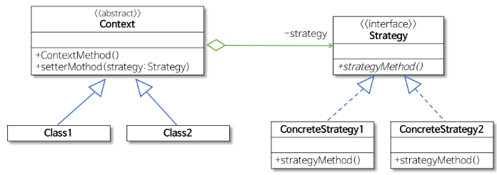
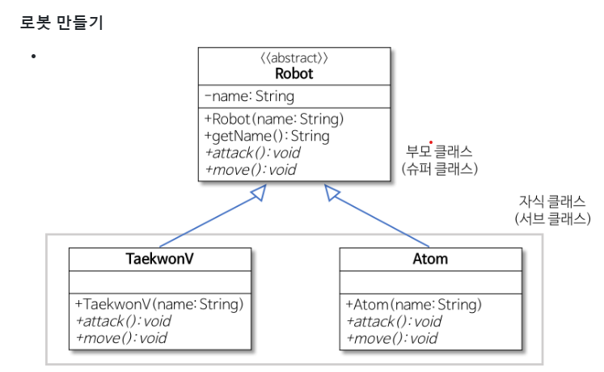
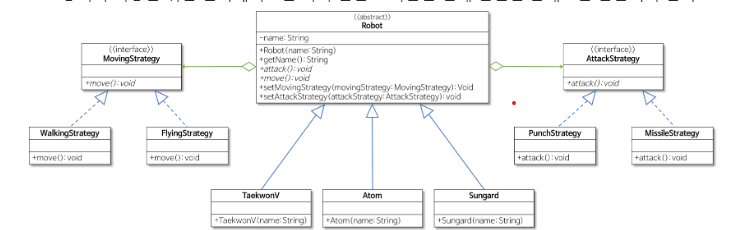

# 스트래티지 패턴(Strategy Pattern)

행위를 클래스로 캡슐화해 동적으로 행위를 자유롭게 바꿀 수 있게 해주는 패턴
같은 문제를 해결하는 여러 알고리즘이 클래스별로 캡슐화되어 있고 이들이 필요할 때 교체할 수 있도록 함으로써 동일한 문제를 다른 알고리즘으로 해결할 수 있게 하는 디자인 패턴

즉, 전략을 쉽게 바꿀 수 있도록 해주는 디자인 패턴이다.

> 스트래티지 패턴은 다음과 같은 상황에서 사용한다.

1. 여러 유사한 작업을 하는 클래스가 있을 때, 각 작업을 별도의 클래스로 분리하고 싶을 때.
2. 알고리즘의 변경이 필요한 경우에 해당 알고리즘을 변경하기 위해 모든 관련 코드를 수정하지 않고도 간단하게 교체하고 싶을 때.
3. 코드의 재사용성과 확장성을 고려하여 설계할 때.

> 스트래티지 패턴은 일반적으로 다음과 같은 구조로 이루어진다.

1. Strategy  
인터페이스나 추상 클래스로 외부에서 동일한 방식으로 알고리즘을 호출하는 방법을 명시
2. ConcreteStrategy  
스트래티지 패턴에서 명시한 알고리즘을 실제로 구현한 클래스
3. Context  
스트래티지 패턴을 이용하는 역할을 수행한다.
필요에 따라 동적으로 구체적인 전략을 바꿀 수 있도록 setter 메서드(‘집약 관계’)를 제공한다.

ex) 소스 별도 첨부

