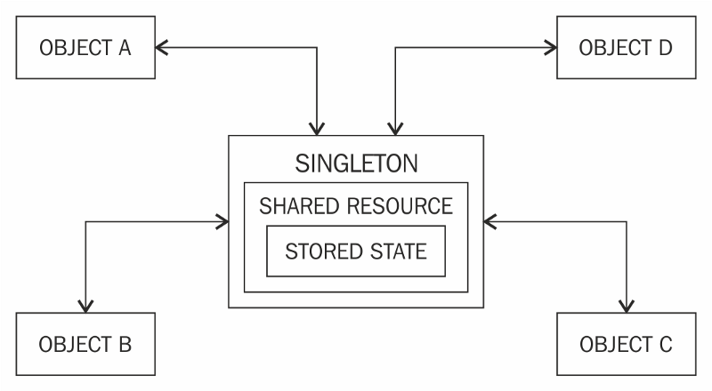
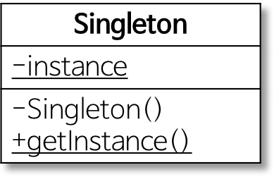
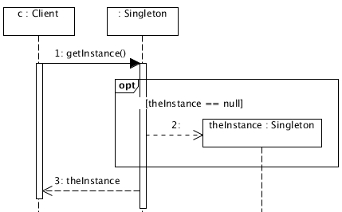

# 싱글턴패턴 

> 생성자가 여러 차례 호출되더라도 실제로 생성되는 객체는 하나이고 최초 생성 이후에 호출된 생성자는 최초의 생성자가 생성한 객체를 리턴한다.



```

public class Printer1 {
	//정적 변수로 유일한 인스턴스 저장
	private static Printer1 printer;
	//생성자의 접근제어자를 private을 선언함으로써 외부에서 생성이 불가하게 한다.
	private Printer1() { }
	
	//외부에서 사용할 인스턴스 생성
	public static Printer1 getPrinter() {
		
		/*
		 * 인스턴스 생성여부 확인하여
		 * 없을 경우 인스턴스 생성한다.
		 */
		if (printer == null) {
			printer = new Printer1(); 
		} 
		
		System.out.println(printer.toString());
		return printer;
	}
	
}


class Main{

	public static void main(String[] args) {
		
		for (int a = 0; a < 10; a++) {
			Printer1.getPrinter(); //동일한 객체를 사용하는것을 확인할수 있다.
		}
	}
}

```


> 단 다중 스레드에서 싱글턴 패턴을 사용할 경우 인스턴스가 1개 이상 생성되는 경우가 있다.
> 

```


public class UserThread extends Thread {

	public UserThread(String name) {
		super(name);
	}
	
	public void run() {
		Printer printer = Printer.getPrinter();
		printer.print(Thread.currentThread().getName() + " print using " + printer.toString());
	}
}

class Printer {
	//정적 변수로 유일한 인스턴스 저장
	private static Printer printer;
	//생성자의 접근제어자를 private을 선언함으로써 외부에서 생성이 불가하게 한다.
	private Printer() { }
	
	//외부에서 사용할 인스턴스 생성
	public static Printer getPrinter() {
		
		/*
		 * 인스턴스 생성여부 확인하여
		 * 없을 경우 인스턴스 생성한다.
		 */
		if (printer == null) {
			printer = new Printer(); 
		} 
		
		return printer;
	}
	
	public void print(String str) {
		System.out.println(str);
	}
}

public class Client {
	private static final int THREAD_NUM = 5;
	
	public static void main(String[] args) {
		
		UserThread[] user = new UserThread[THREAD_NUM];
		
		System.out.println("a");
		for (int i = 0; i < THREAD_NUM; i++) {
			user[i] = new UserThread((i + 1) + "-thread");
			user[i].start();
		}
		
	}
}
```

위 소스 살행시 한개의 인스턴스가 아닌 여러개의 인스턴스가 실행되는것이 확인된다.


> 다중 스레드로 인한 문제 해결 방법 <br>
> * 정적 변수에 인스턴스를 만들어 바로 초기화하는 방법 (Eager Initialization)
```
class Printer {
	//정적 변수에 인스턴스를 만들어 초기화하는 방법
	private static Printer printer = new Printer();
	
	private int count = 0;
	private Printer() { }
	
	//외부에서 사용할 인스턴스 생성
	public static Printer getPrinter() {
		return printer;		
	}
	
	public void print(String str) {
		count++;
		System.out.println(str + " : " + count);
	}	
}
```
> * 인스턴스를 만드는 메서드에 동기화(synchronized)하는 방법(Thread Safe Singleton)
```
class Printer {
	private static Printer printer = null;
	
	private int count = 0;
	private Printer() { }
	
	//외부에서 사용할 인스턴스를 동기화하는방법
	public synchronized static Printer getPrinter() {
		if (printer == null) {
			printer = new Printer();
		}
		return printer;		
	}
	
	public void print(String str) {
		count++;
		System.out.println("동기화");
		System.out.println(str + " : " + count);
	}	
}
```

Synchronized : 임계 영역 (Critical Section)을 형성해 해당 영역에 오직 하나의 thread만 접근 가능하게 한다.




> 싱글턴 패턴의 순차 다이어 그램 <br>

> <br>
> * 클라이언트가 싱글턴 클래스에 getInstance 메소드를 통해 객체 생성을 요청
> * 해당 객체 생성 여부를 확인
> * 해당 객체가 없을 경우 생성자를 호출해 객체 생성
> * 해당 객체가 있을 경우 기존 생성된 객체 전달

