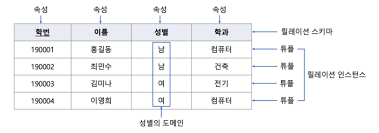

# 1. 데이터

## 1.1 데이터

    숫자처럼 양으로 측정할 수 있는 데이터를 정량적 데이터, 텍스트나 이미지처럼 양으로 측정할 수 없는 데이터를 정성적 데이터라고 한다.

    정량적 데이터는 구조화되어 저장되기 때문에 정형(strucctured)데이터, 정성적 데이터는 반대의 의미로 비정형(unstructured)데이터라고 부른다. 이런 이유로 정량적 데이터 분석을 정형 분석, 정성적 데이터 분석을 비정형 분석이라고 부르기도 한다. SQL은 정형 분석에 사용되는 프로그래밍 언어이다.

    데이터,정보,지식,지혜는 순환 관계를 가진다.
    데이터를 분석하여 정보를 생성하고, 정보를 해석함으로써 지식을 축적하고, 축적한 지식에서 지혜를 얻고, 지혜를 실천함으로써 새로운 데이터가 발생하는 과정이 반복된다.

## 1.2 데이터베이스

    데이터베이스란 "데이터를 정리해서 모아둔 것"으로 해석한다.

    관계형(relational)모델 
    릴레이션에 데이터를 저장하며 2차원 형태의 표로 구성된다. 
    릴레이션은 튜플의 집합이며, 튜플은 속성의 집합이다.

    관계형 모텔을 채택한 데이터베이스를 관계형 데이터베이스(Relational DataBase, RDB)라고 한다.

## 1.3 데이터베이스 관리 시스템

    데이터베이스 관리 시스템(DataBase Management System, DBMS)은 데이터베이스를 관리하기 위한 응용 프로그램이다.