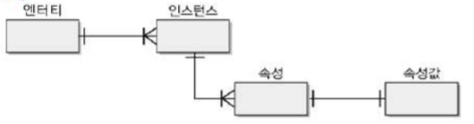
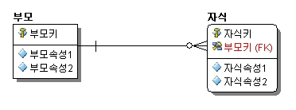
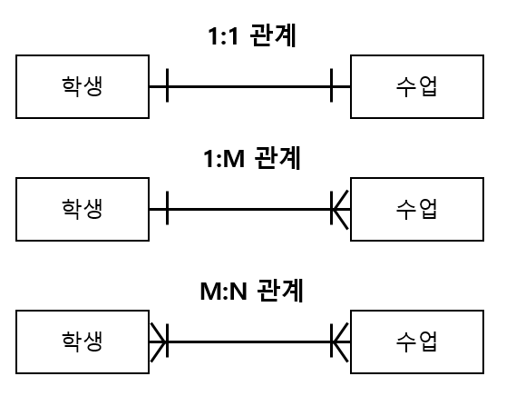

# 데이터 모델링

## 2.1 데이터 모델

    데이터 모델은 현실 세계를 데이터베이스로 구축할 수 있도록 추상화 한것이다.

    데이터 모델은 상세화 수준에 따라 개념데이터 모델, 논리 데이터 모델, 물리 데이터 모델로 구분된다.

## 2.2 E-R 모델

    E-R 모델은 엔터티와 관계로 데이터를 표현한다.

E-R모델의 개념
|개념 | 집합 | 개별 |
|:---|:----:|:-----:|
|어떤것| 엔터티 타입 | 엔터티, 인스턴스|
|어떤 것의 관계 | 관계 | 페어링 |
|어떤 것의 특징 | 속성 | 속성 값 |

엔터티와 인스턴스, 속성, 속성값의 관계

### 2.2.1 엔터티(entity)

    엔터티는 개체로 인식할 수 있는 데이터의 집합이다. (table)

#### 2.2.1.1 기본식별자(primary idemtifier)

    기본식별자(primary idemtifier)은 엔터티에서 인스턴스를 고유하게 식별할 수 있는 속성이다. 
    엔터티는 반드시 기본 식별자를 가져야 한다.
    
    하나의 속성으로 구성된 식별자를 단일 식별자,
    2개 이상의 속성으로 구성된 식별자를 북합 식별자라고 한다.

### 2.2.2 속성(attribute)

    속성은 엔터티에서 관리되는 데이터의 최소 단위이다.

    속성은 업무적으로 분리되지 않아야 하며, 하나의 속성값만 가져야 한다.

#### 2.2.2.1 도메인(domain)

    도메인은 속성값의 범위를 나타내며, 물리 모델에서 데이터 타입과 제약 조건으로 변환된다.

### 2.2.3 관계(relationship)

    관계는 엔터티 간의 업무적 연관이다.
    하나의 엔터티는 하나 이상의 엔터티와 관계를 가질 수 있고, 관계를 가진 엔터티와 또 다른 관계를 가질 수도 있다.

부모 엔터티와 자식 엔터티의 관계

    자식 엔테티는 부모 엔터티의 기본 식별자를 상속받는다. 
    부모 엔터티로부터 상속받은 식별자를 외래식별자(foreign identifier)라고 한다.

#### 2.2.3.1 카디널리티(cardinality)

    카디널리트는 하나의 부모 인스턴스가 몇 개의 자식 인스턴스와 페어링될 수 있는지를 나타낸다.
    1:1, 1:M, M:M 관계가 존재한다.

    1:1 관계 : 하나의 학생은 하나의 수업만 가질 수 있고, 수업은 하나의 학생만 들을 수 있다.

    1:M 관계 : 여러명의 학생은 하나의 수업을 가질수 있고, 하나의 수업은 여러명의 학생이 들을 수 있다.

    M:M 관계 : 부적절한 관계를 가지며 M:M 관계를 해소해야 한다.

#### 2.2.3.2 옵셔널리티(optionality)

    옵셔널리티는 부모 인스턴스와 자식 인스턴스의 페이렁 여부를 나타낸다.

    페어링되어야 하면 필수(mandatory)관계, 페어링되지 않아도 되면 선택(optional)관계를 가진다.

#### 2.2.3.3 관계 유형

    관계 유형은 식별 관계와 비식별 관계로 구분된다. 부모 엔터티의 기본 식별자가 자식 엔터티의 기본 식별자 속성으로 상속되면 식별관계, 일반 속성으로 상속되면 비식별관계이다.

    식별관계를 가질 경우 밀접한 관계를 가진다.
    비식별관계일 경우 느슨한 관계를 가진다.

## 2.3 정규형(Normal Form)

    정규형은 데이터 이상 현상을 제거하기 위한 관계형 모델의 설계 지침이다.

### 2.3.1 정규화(normalization)

    정규화는 정규형을 위배한 릴레이션을 정규형으로 만드는 과정이다. 

    1정규형
    
    1정규형은 속성의 원자성과 관련있으며
    다가 속성과 반복 속성과 연관이 있다.

    다가 속성 : 하나의 속성의 여러개의 속성값을 가지는 것

    반복 속성 : 하나의 엔터티에 비슷한 속성이 여러개 있는것

    2정규형
    2정규형은 부분 종속과 관련이 있다.
    부분 종속이 될 경우 데이터 이상 현상이 발생한다.

    부분 종속 :  일반 속성이 식별자의 일부 속성에만 종속되는 것이다.

    3정규형
    3정규형은 이행 종속과 관련이 있다.

    이행 종속 : 일반 속성이 다른 일반 속성에 종속되는 것이다.

## 2.3.2 반정규화(denormalization)

    반정규화는 성능 개선을 위해 의도적으로 데이터를 중복시키는 것이다.
    정규화의 경우 삭제,갱신 성능이 올라가지만 조회의 경우 성능 저하가 올 수 있기 떄문에 반정규화를 통해 조회 성능을 올릴 수 있다.

