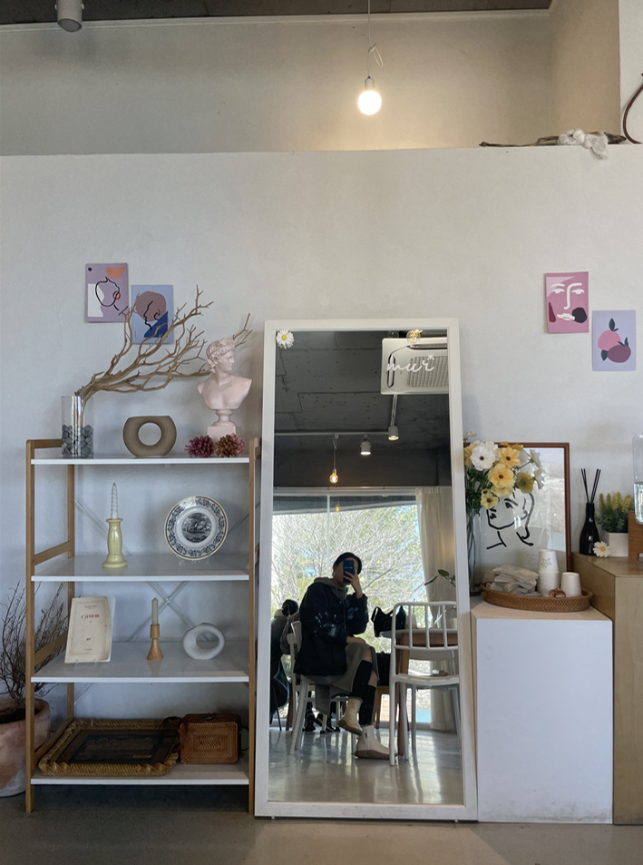
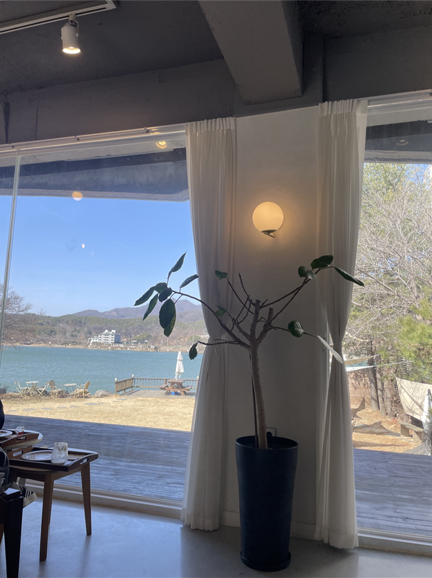
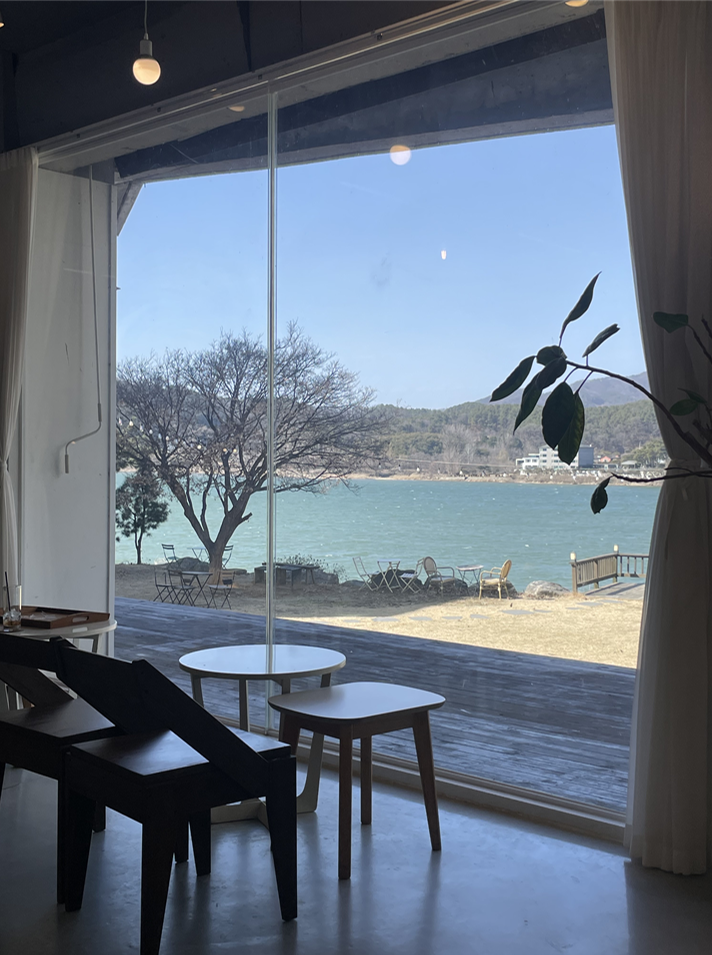
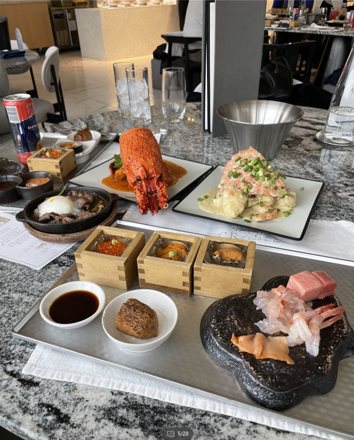
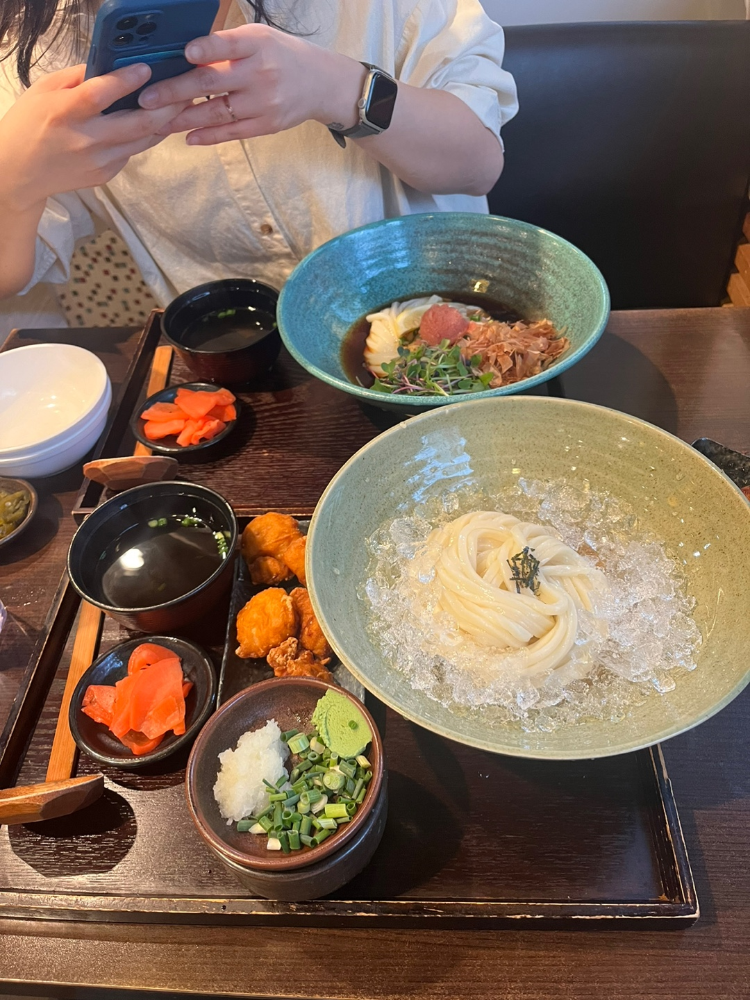
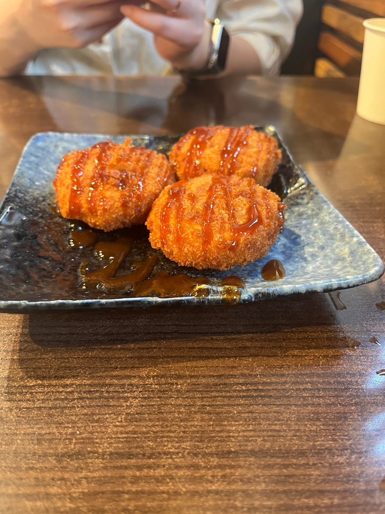

# 20000101(일)

## 양평 ㅣ 

### 장소 : 
### 위치 : 
### 메뉴 : 
### 특징 : 

### 이미지 :

-------------

# 20240301(금) 
## 장소 : 양평

### 장소 : 카페무르
### 위치 : 경기 양평군 강하면 강남로 379 1층 
### 메뉴 : 프렌치코스트 플래터, 고르곤졸라 파니니, 아이스아메리카노, 무르크림라떼
### 특징 : 아름이 아시는분 만남, 카페 경치가 좋았으나 길이 너무 막힘, 맛과 분위기가 좋으나 근처에 좋은 카페들이 있어 다음에 또올지는 모르겠음 만약에 온다면 실내보다 실외에서 먹는것을 도전 물론 아름이 허락하에

### 이미지 : 

----------------------------------

### 장소 : 제이델링 양평점
### 위치 : 경기 양평군 용문면 다문중앙1길 3
### 메뉴 : 맞춤 도시락 케이크
### 특징 : 치즈케이크면서 케이크 내부에는 딸기 케이크이다. 디자인이 훌륭하며 맛또한 매우 괜찮다. 다음 기념일에는 내가 직접 해당 가게에 주문제작을 요청하는것도 좋은 방법일듯함

### 이미지 :

----------------------------------

### 장소 : 이솝이야기
### 위치 : 경기 양평군 용문면 상망길 110-47
### 메뉴 : 밀푀유나베
### 특징 : 원목 독채 펜션 급하게 예약했으나 매우 훌륭한 선택지가 되었음. 친절한 사장님과 조용한 주변 따뜻한 실내와 디자인 하지만 화장실이 매우 추움 너무 추움 다음에 또 올만하다. 다음에는 히노끼탕 또는 스파를 해보는것도 나쁘진 않을듯 하다 물론 안추울때 아름이가 밀푀유나베가 맛있다고해서 정말 다행이다. 다음에는 더 맛있게 하자

### 이미지 :

----------------------------------

 
 

# 20240302(토)

## 장소 : 양평

### 장소 : 나해
### 위치 : 경기 양평군 용문면 다문중앙2길 13
### 메뉴 : 유기농 석쇠 LA갈비 쌈밥정식
### 특징 : 이번여행 아쉬운 가게 아름이에게 매우 미안했다. 티비에서 세상 맛있게 먹길래 기대를 했으나 티비는 믿으면 안된다는 사실을 다시 한번더 깨닫게 해준 가게 

### 이미지 :

----------------------------------

### 장소 : 콘크리트정글
### 위치 : 경기 양평군 용문면 용문로 116
### 메뉴 : 드립커피, 아이스아메리카노, 딸기 쿠키슈, 카야 버터 프리젤 그외 포장용 빵 다수
### 특징 : 쌈밥집에서 실망한것을 여기서 다 매꿈 매우 훌륭했다. 가게, 풍경, 빵 그리고 커피 아름이에게 충분한 만족을 준것 같아서 매우 만족스러운 가게 그리고 아름이 비밀 한가지를 알게 되었다 변!비! 좋은 유산균이 있으면 추천해주자. 다음에 또 올만 하다.    PS 내가 사진을 더 잘찍는거 같은데 아닌가? 

### 이미지 :

----------------------------------

 
 

# 20240303(일) 100일!!

## 장소 : 삼성역

### 장소 : 크랩52
### 위치 : 서울 강남구 영동대로 511 52층
### 메뉴 : 해산물 뷔폐
### 특징 : 살면서 먹은 게, 새우, 랍스타 다먹어봄 매우 맛있었다 역시 돈을 벌어야한다는것을 느낌 아름이가 매우 좋아함 분기마다 한번씩 와야겠다라는 생각이 들었으며 동시에 아름이 눈동자에서 나를 잘 키워보겠다는 열망이 듬 

### 이미지 :

-------------------------------------------

### 장소 : 코엑스 펀시티
### 위치 : 서울특별시 강남구 영동대로 513 B2층
### 특징 : 게임방 아름이가 재밌어하는곳 아름이와 갈때마다 매번 재밌다. 현금 지참 필수 아름이가 인형뽑기하는 날이면 현금 다수 지참 필수
---------------------------------------------

### 장소 : 클로리스 코엑스몰점 
### 위치 : 서울 강남구 영동대로 513 . 지하1층 I-109호
### 메뉴 : 클래식 밀크티, 아이스아메리카노
### 특징 : 밀크티가 맛있었다. 매우 지쳐있는 상태에서 발견한 오아시스 같은 존재 또한 집에서 읽기로 한 편지를 거기서 읽어 굉장히 부끄러웠음

### 이미지 : 
 
-------------------------------------------

 
 

# 20240309(일)

## 광주

### 장소 : 그랜마스
### 위치 : 경기 광주시 경충대로1481번길 22
### 메뉴 : 묵직한 치즈 파니니, 그랜마스셀러드, 아아2잔, 치즈프레즐
### 특징 : 흙뷰가 보인다. 매장이 매우 크고 깨끗하나 손님이 많아 직원분들이 정신 없음 아름이가 다음에 또 가자고 함

### 이미지 :

----------------------------------

### 장소 : 와인곳간 산성포레스티아점
### 위치 : 경기 성남시 수정구 수정로 291 산성역 포레스티아아파트 서문상가 2층 (수정구청 옆)
### 특징 : 사장님이 친절하심 나중에 방문 해보는것도 괜찮을듯 beret 와인 나중에 사기 
----------------------------------

### 장소 : 남한산성(계곡산장)
### 위치 : 남한산성
### 특징 : 야경이 매우 좋음, 계곡산장에 주차후 좀 걸어가야함 포장도로라 걷기가 괜찮으나 운동화가 필수, 아직은 춥기 때문에 날 좋을때 오면 매우 좋을것 같다.

### 이미지 :

----------------------------------

### 장소 : 경성빵공장
### 위치 : 경기 광주시 남한산성면 남한산성로 714
### 메뉴 : 차, 밀크티, 집들이용 빵
### 특징 : 아름이가 차를 좋아함 (얼그레이) 나중에 괜찮은 차보이면 선물해주기, 늦은 시간에 가서 빵이 거의 없음, 그 주변에 그나마 늦게까지 문여는 곳
----------------------------------

 
 

# 20240313(수)

## 성남 서현

### 장소 : 낙원타코
### 위치 : 경기 성남시 분당구 황새울로 337 웰빙프라자 2층 203호
### 메뉴 : 낙원파히타, 치폴레 크림파스타
### 특징 : 맛있음 다음에 또오자고함. 다음에는 어니언닝 먹고싶다구한다. 역시 쌈먹는것을 좋아함. 쌈먹는거 마져 이쁜 갓아름 외쳐 갓

### 이미지 : 

----------------------------------

### 장소 : 카페굿웨더
### 위치 : 경기 성남시 분당구 황새울로342번길 19 유성그린빌딩 2층
### 메뉴 : 딸기빙수
### 특징 : 맛있음 다음에 또오자고함. 이미지 영수증이 있어 아름이랑 사진을 찍을수 있어 좋았다. 여름에 빙수먹으러 자주 올듯하다. 하지만 빙수 먹을때 이시린 우리 누나를 위해 이가탄을 준비하는 센스!

###이미지 : 

----------------------------------

 
 

## 성남 야탑

### 장소 : 수타우동 겐 본점
### 위치 : 경기 성남시 분당구 야탑로 72 1층 수타우동 겐 본점
### 메뉴 : 명란붓가케, 가라아게와자루, 감자고로케
### 특징 : 맛있으나 홍대에 있던 가게가 더 맛있다고함 지금은 이태원으로 가게 옮김(멘멘츠케멘 서울), 고로케가 맛있었음 나도 모르게 아름이꺼 뺏어먹음

### 이미지 : 

----------------------------------

## 한강 잠실

### 장소 : 한강 잠실
### 위치 : 서울 송파구 한가람로 65 한강사업본부 잠실안내센터
### 특징 : 산책 매우 행복 봄이 기다려지기는 처음이다. 다음에는 잠실이 아닌 다른곳 가자. 의자를 가지고 다니고 싶어함
