# 20024405(금)

## 장소 : 이천, 여주

### 장소 : 설봉공원
### 위치 : 경기 이천시 경충대로2709번길 128
### 특징 : 아름이가 좋아하는 산책길, 좋은 추억이 많다고 한다. 나도 설봉 공원에서 좋은 추억을 쌓아보자

### 이미지 : 
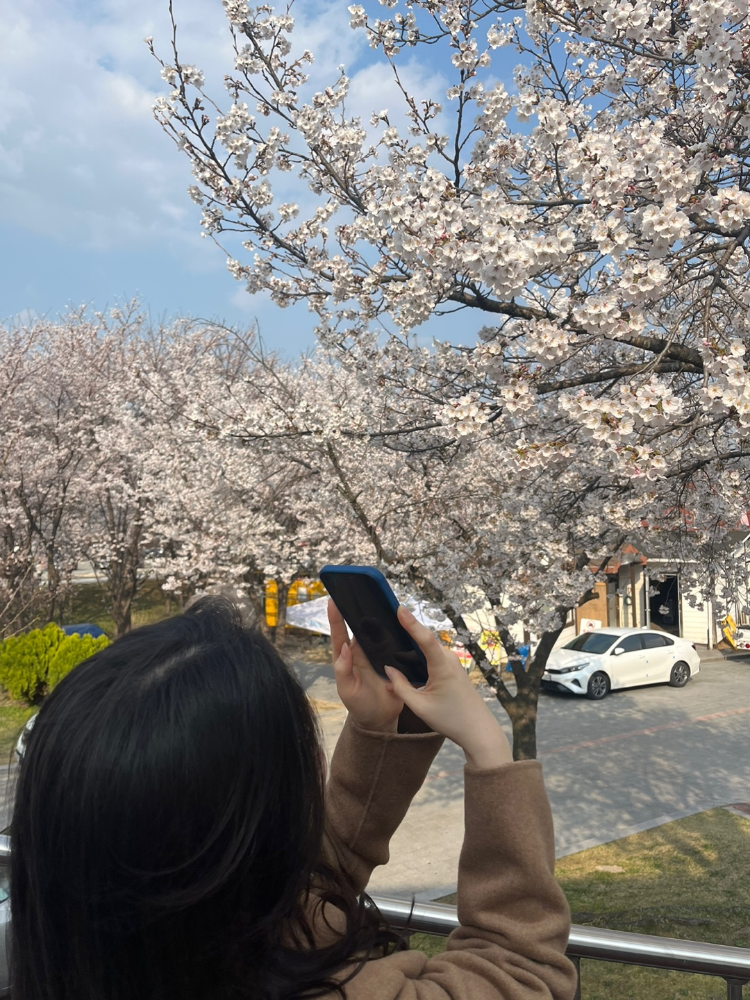
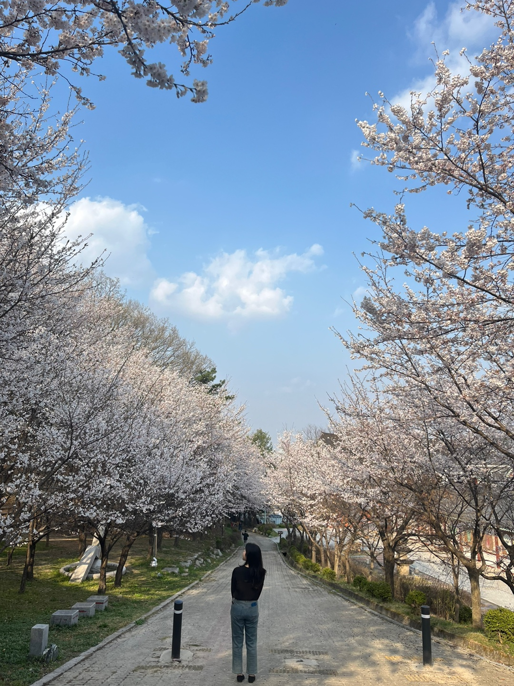

### 장소 : 인도카페
### 위치 : 경기 여주시 세종대왕면 새미실2길 40
### 특징 : 여주 카레 맛집, 로컬들만 안다는 찐 맛집이다. 식당이 정말 특이한 곳에 위치함
### 메뉴 : 치킨커리, 루바브라씨

### 이미지 : 
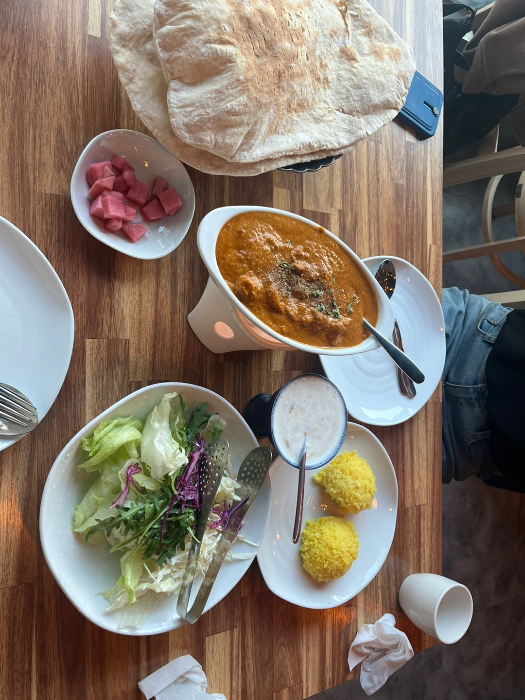

### 장소 : 흥천남한강
### 위치 : 경기 여주시 흥천면 귀백리 38-8
### 특징 : 가는 날이 장날이라고 정말 의도치 않게 축제를 목격함. 매우 재밌었다. 내년에도 또 갈 수 있기를

### 이미지 : 
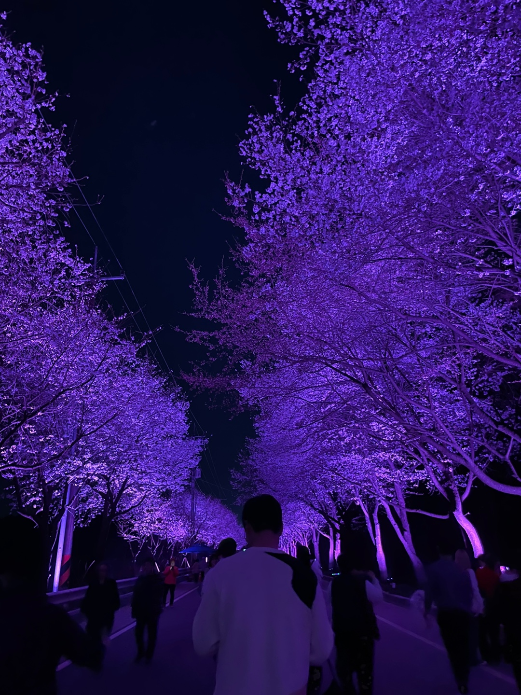
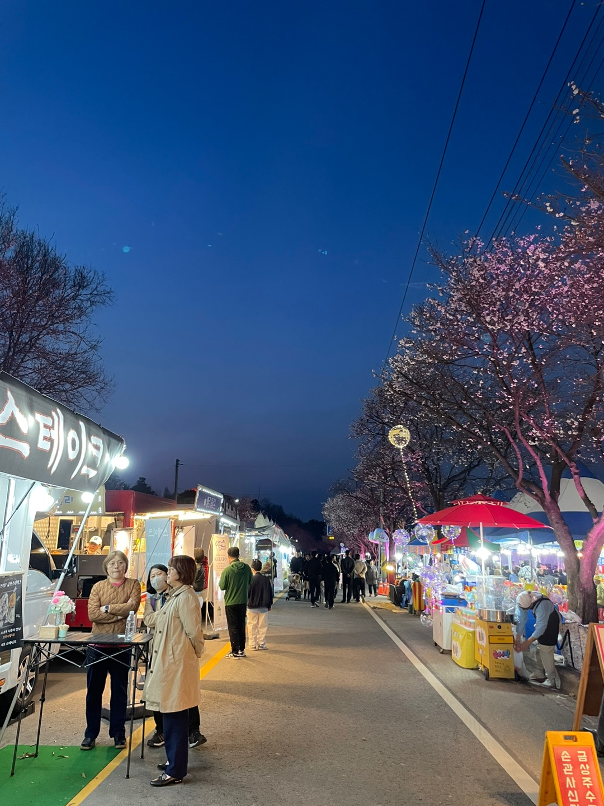
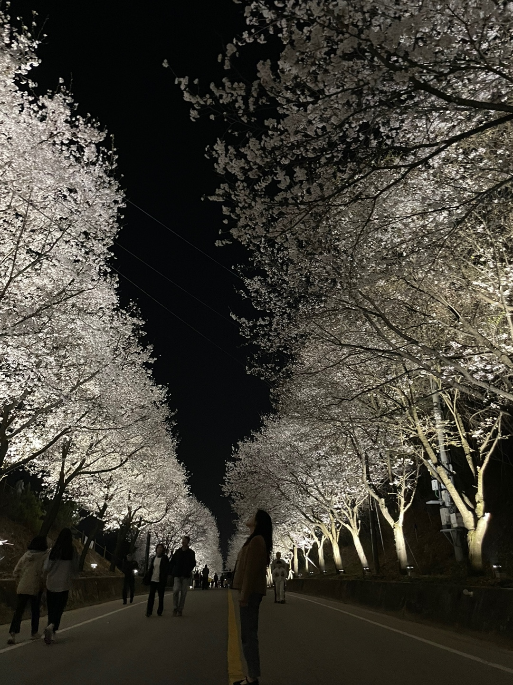

---------------------------------------------------------------------------------------------

 
 

# 20024406(토)

## 장소 : 충주

### 장소 : 중앙탑메밀마당
### 위치 : 충북 충주시 중앙탑면 탑평리 42
### 특징 : 찐 치킨 맛집 먹어본 치킨중 최고였다.

### 이미지 : 
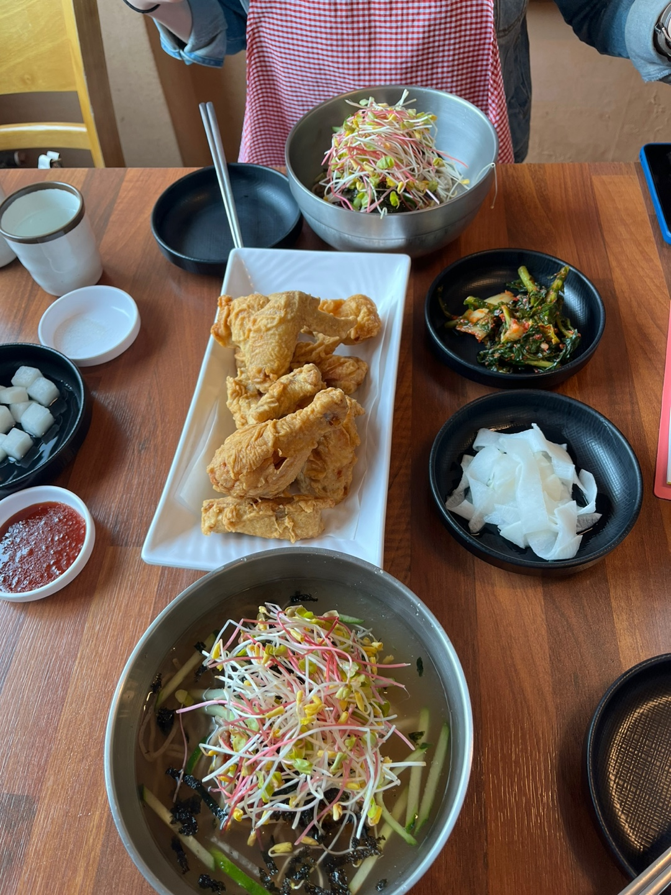

### 장소 : 충주댐
### 위치 : 충북 충주시 동량면 조동리 산180-11
### 특징 : 가는길에 차가 매우 많았음. 더운날 쫌 많이 걸어야 해서 고생함, 그래도 이뻤다. 만족스럽다. 문화관에서 세미콘서트도 재밌게 잘 봄. 

### 이미지 : 
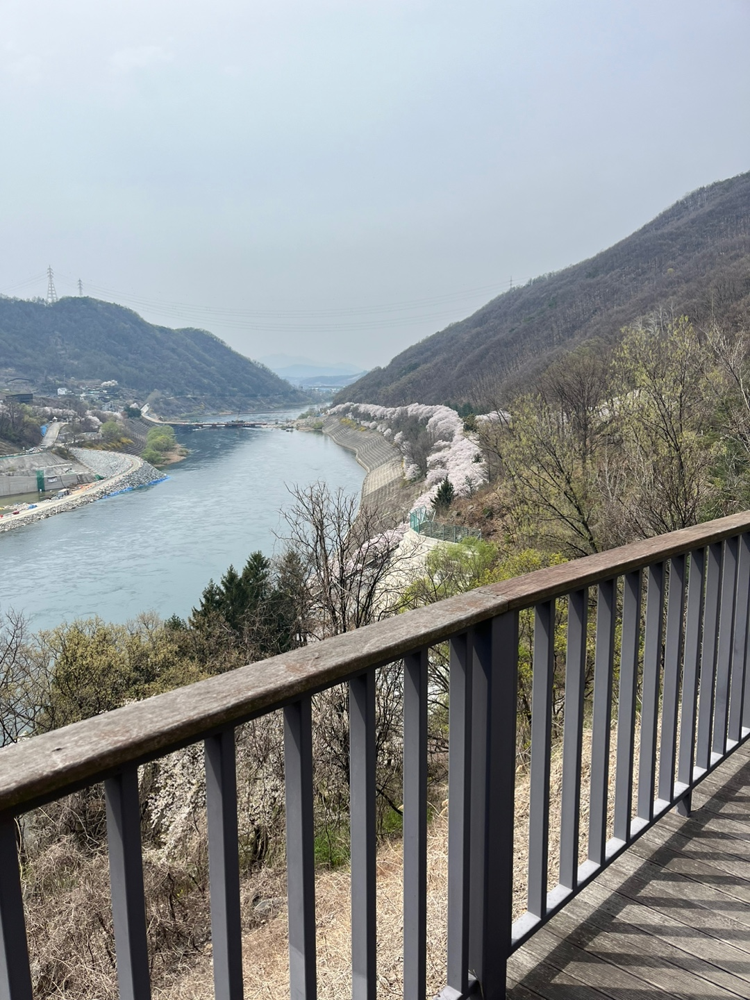
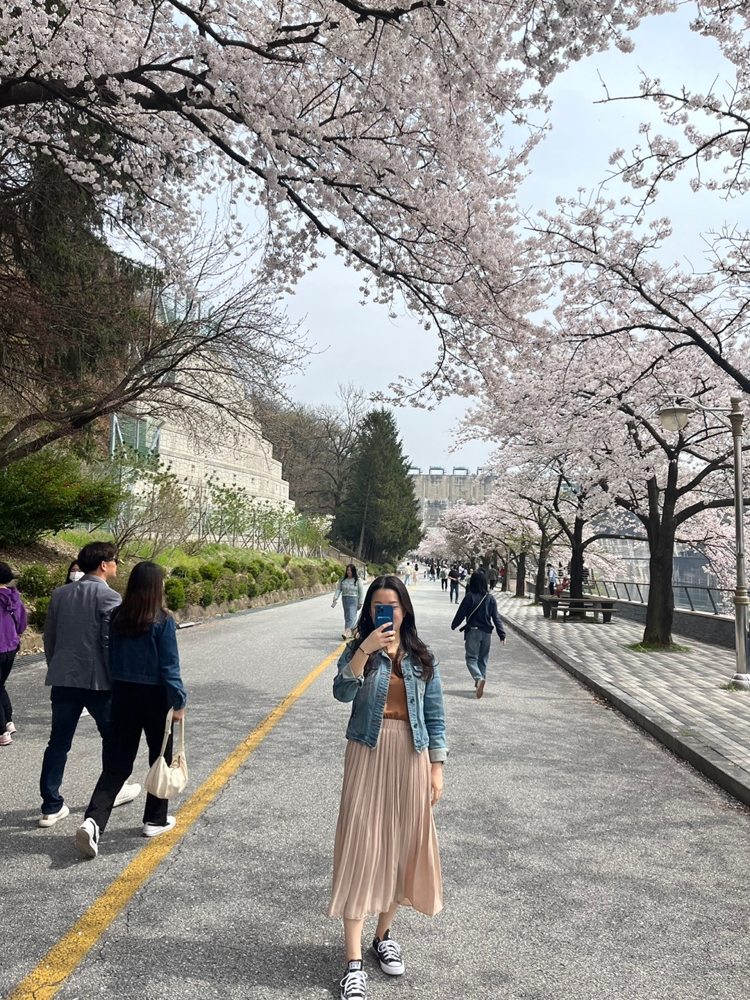
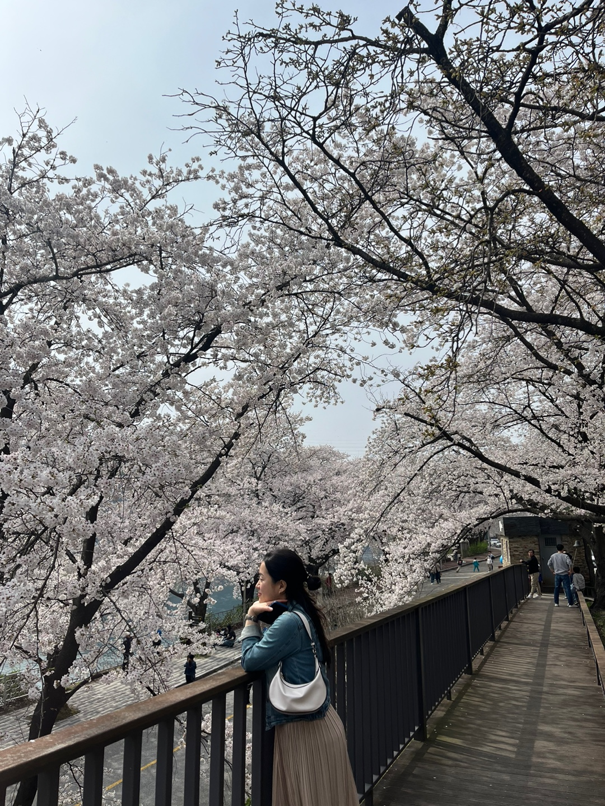

### 장소 : 터줏골명가
### 위치 : 충북 충주시 금제7길 14 터줏골명가
### 특징 : 짜글이 맛집. 짜글이가 충청도 음식이란것을 처음암 우리 엄마는 왜 못하지? 볶음밥은 생각보다 별로 였다.

### 이미지 : 
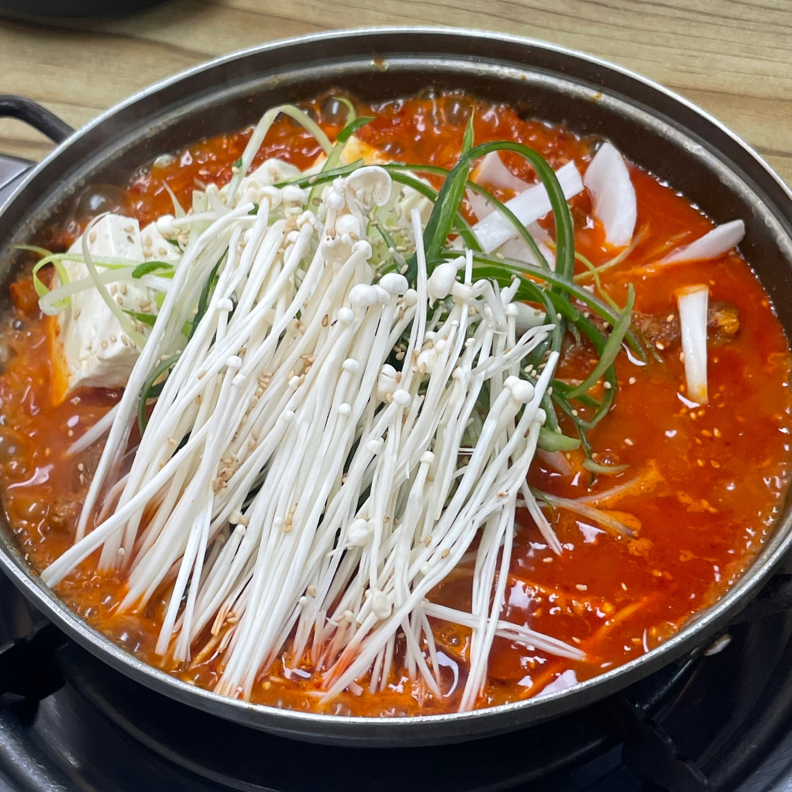

### 장소 : 하방마을
### 위치 : 충북 충주시 하방1길 61
### 특징 : 숨겨진 벚꽃 명소인줄 알았더니 알고보니 세상사람 다 아는 명소였다. 벚꽃도 기억에 남지만 제일 기억에 남는건 치즈떡먹는 아름이 영상으로 봐야 1000000배는 더 귀여움

### 이미지 : 
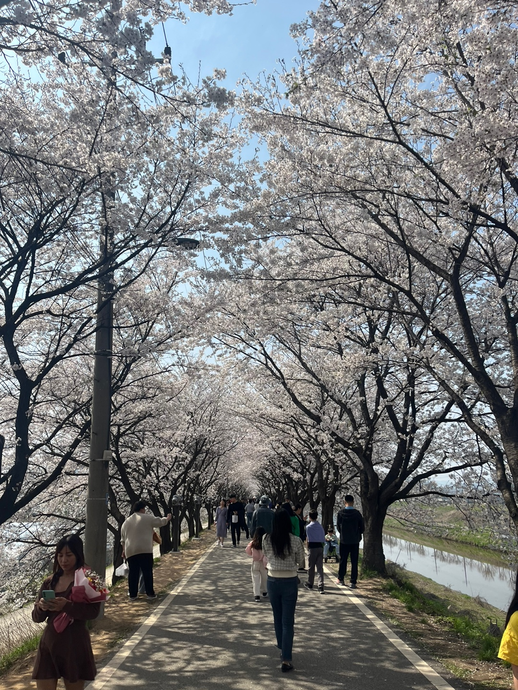
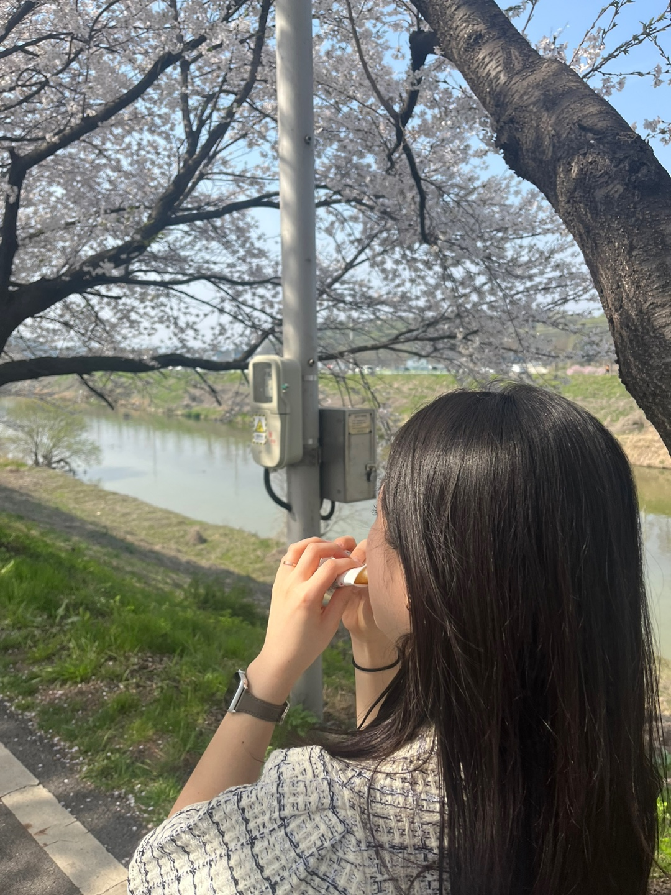