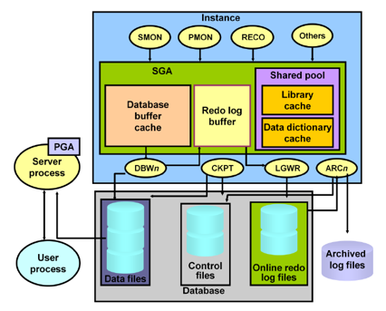

# DB버퍼캐시

> https://velog.io/@yooha9621/1.-%EB%8D%B0%EC%9D%B4%ED%84%B0-%EB%AA%A8%EB%8D%B8%EB%A7%81%EC%9D%98-%EC%9D%B4%ED%95%B4DB-%EB%B2%84%ED%8D%BC-%EC%BA%90%EC%8B%9C

> https://m.blog.naver.com/PostView.naver?isHttpsRedirect=true&blogId=sg5107&logNo=220594233282

> 사용자가 입력한 데이터를 데이터 파일에 저장하고 이를 다시 읽는 과정에서 거쳐가는 캐시영역
물리적인 I/O를 최소화하기 위해 최근에 사용한 블록에 대한 정보를 저장하는 메모리의 일정 영역

<h3>(1) 블록단위 I/O</h3>

오라클에서 I/O는 블록단위로 이루어 진다.

<ul class="alternate" type="square">
	<li>메모리 버퍼 캐시에서 버퍼 블록을 액세스 할때 블록 I/O</li>
	<li>데이터파일에 저장된 데이터 블록을 DB 버퍼 캐시로 적재할때 블록 I/O</li>
	<li>캐시에서 변경된 블록을 다시 데이터파일에 저장할 때 블록 I/O</li>
 
single block I/O : 인덱스를 경유해 테이블 액세스시. 
multi block I/O : Full Table Scan 시
 
=&gt; 옵티마이져가 인덱스를 이용해 테이블을 액세스할 지, Full Table Scan을 할 지를 결정하는 판단 기준은 읽어야 할 레코드 수가 아니라 블록 갯수이다. 
</ul>

<h3>(2) 버퍼 캐시 구조</h3>

해시테이블 구조로 관리 됨.
 
해싱(hasing)알고리즘 &lt;= 주소록에 비유 
해시버킷 - 성씨가 같은 고객은 같은 페이지 
입수시점이 같지 않으므로 해시 버킷내에서는 정렬상태를 유지 하지 않는다.(스캔방식으로 탐색)
 
<ul>
   해시 체인은 Shared  Pool 내에 존재, 버킷(Bucket) ==&gt; 체인(Chain) ==&gt; 헤더(Header)의 구조.   
</li>
	<li>해시 테이블(Hash table)은 여러개의 해시 버킷으로 구성.</li>
	<li>블록의 주소(Database Block Address)와 블록클래스에 대해 해시함수 적용한 결과를 이용하여 버킷을 찾아간다.</li>
	<li>해시 버킷에는 같은 해시 값을 갖는 버퍼 헤더들이 체인 형태 있다.</li>
	<li>버퍼 헤더는 버퍼에 대한 메타 정보, 버퍼 메모리 영역의 실제 버퍼에 대한 포인터 값을 가지고 있다.
 
=&gt; 찾고자 하는 데이터블록 주소를 해시값으로 변환해서 해당 해시 버킷에서 체인을 따라 스캔하다가 찾아지면 바로 읽고, 
찾지 못하면 디스크에서 읽어 해시 체인에 연결한 후 읽는다. 
</ul>

<b>Hash table -&gt; Hash bucket -&gt; buffer header chain -&gt; buffer header -&gt; buffer body -&gt; block header -&gt; block body</b>
 

<h3>(3) 캐시 버퍼 체인</h3>

 
<b>정의</b> 
각 Database Buffer는 Data Block Address(DBA)가 Hash Function에 의해 해시되어 Hash Table에 할당되어 관리되는데, 이를 Cache Buffer Chain List라 한다. 
즉 Cache Buffer Chain List란 양방향의 링크된 리스트로, 인스턴스가 시작될 때 할당되는 Hash Table로 구성된다.  
이 Hash Table 안의 Bucket은 각 Database Block Buffer들의 Header 정보를 가지며, 이 각 Buffer들은 LRU List 나 Dirty List의 한 가지에 속한다.
 
	<li>래치 
=&gt; 같은 리소스에 대한 액세스를 직렬화 하여 리소스를 보호하기 위해 구현된 일종의 Lock 메커니즘.
 
	<ul>
		<li>캐시 버퍼 체인 래치이벤트의 대기원인* 
버퍼 캐시를 사용하기 위해 해시 체인을 탐색하거나 변경하려는 프로세스는 반드시 해당 체인을 관리하는 cache buffers chains 래치를 획득해야 한다.  
cache buffers chains 래치를 획득하는 과정에서 경합이 발생하면 latch: cache buffers chains 이벤트를 대기하게 된다. 
 

<table class='infoMacro'><colgroup><col width='24'><col></colgroup><tr><td valign='top'></td><td><b>캐시 버퍼 체인 래치 경합이 발생하는 대표적인 경우</b> 
<ul class="alternate" type="square">
	<li>비효율적인 SQL - 동시에 여러 프로세스가 넓은 범위의 인덱스나 넓은 범위의 테이블에 대해 스캔을 수행할 경우. 
- 핫블록(Hot Block) - SQL 문의 작동방식이 소수의 특정 블록을 계속해서 스캔하는 형태로 작성되었다면, 여러 세션이 동시에 이 SQL 문을 수행하는 경우.</li>
</ul>
</td></tr></table>
</ul>
<h3>(4) 캐시버퍼 LRU 체인</h3>

<b>두 종류의 LRU(Least Recently Used) 리스트 사용</b>

	</ul>
	<ul class="alternate" type="square">
		<li>Dirty 리스트* : 캐시 내에서 변경됐지만, 아직 디스크에 기록되지 않은 Dirty버퍼 블록들을 관리.LRUW(LRU Write)리스트 라고도 함.</li>
		<li>LRU 리스트* : 아직 Dirty 리스트로 옮겨지지 않은 나머지 버퍼블록들을 관리함.

<table class='infoMacro'><colgroup><col width='24'><col></colgroup><tr><td valign='top'></td><td><b>LRU 리스트의 버퍼의 상태</b> 
1) Free 버퍼 : 아직 데이터가 읽히지 않아 비어있는 상태 혹은 언제든지 덮어써도 무방한 상태. 
2) Dirty 버퍼 : 버퍼에 캐시된 후 변경이 발생했지만, 아직 디스크에 기록되지 않아 동기화가 필요한 버퍼블록. 
3) Pinned 버퍼 : 읽기 또는 쓰기 작업을 위해 현재 액세스되고 있는 버퍼블록.
</td></tr></table>
 

>DB 구조  

