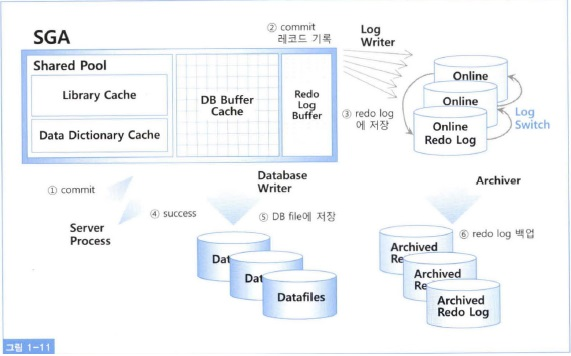

# Redo


<h3>Data Buffer Cache, Log Buffer 존재 이유</h3>
<div><div>
<pre>
- Data Buffer Cache : DB 의 최소 입출력 단위인 Block 이 상주하는 곳으로, 쿼리 수행시에 필요한 Data block 이 위치하는 메모리 영역.
- Log Buffer : 쿼리 수행시 변경사항 (DML) 에 의해 Data 의 변경이 발생한 내역을 Log 로 남겨 저장하는 메모리의 영역.
- Checkpoint : Data buffer cache 에서 Datafile 로 기록될때 실질적으로 발생.
- Commit : Checkpoint 이전에 발생할 수 있는 에러에 대비하여 Recovery 를 제공하는것.
즉, Data 변경사항에 대하여 redo log 를 남기는 행위이며, checkpoint 는 Data buffer cache 의 변경된 (dirty buffer) block 을 data file 에 기록하는 것.
- 결론 : DB 에서 Data 정합성을 유지하며, 나은 성능을 보장하기 위하여 Log buffer 와 Data buffer cache 가 존재.
</pre>
</div></div>

## Redo란
> DDL 또는 DML 문장에 의해 데이터베이스에 저장된 값 또는 테이더베이스 구조에 변경사항이 생기는 경우 이러한 정보를 놓치지 않고 저장하는 메모리 영역

> 해당 영역에 저장되는 정보들은 커밋되는 순간 LGWR(Log Writer)에 의해 리두 로그 파일(Redo Log file)로 저장된다. 다시 말해 메모리 영역에 저장된 데이터를 디스크에 쓴다고 보면 된다.

## Redo 구성
* Online Redo Log
  > - Oracle의 모든 Instance에는 Online Redo Log가 있다. 여기에는 DB에서 처리된 모든
Commit된 기록하는 두개 이상의 Log File로 구성된다.<br>현재 사용 중인 Redo로그 파일이 꽉 차면 다음 Redo로그 파일로 로그 스위칭이 발생하며 계속 Redo로그를 써 나가다가 모든 Redo 로그 파일이 꽉 차면 다시 첫 번째 Redo 로그 파일부터 재사용하는 라운드 로빈방식을 사용한다.<br>BackGround Process인 LGWR는 Transaction이 Commit될때 마다 SGA의 Redo Log Buffer 에 임시로 저장된 해당 Redo Log 항목을 Online Redo Log File에 기록한다.

* Archived Redo Log
    >Online Redo Log와는 다르게, 이미 사용된 Online Redo Log 파일들을 안전하게 보관하는 로그입니다.<br> 데이터베이스에서 Online Redo Log 파일이 꽉 차게 되면, 이전에 사용한 로그 파일들을 Archived Redo Log로 옮겨 보관하게 됩니다. 이것은 데이터베이스의 백업과 장애 복구를 위해 중요한 역할을 합니다.<br> Archived Redo Log를 사용하여 특정 시점의 데이터 상태를 복구하거나, 데이터베이스를 새로운 장비로 복원할 수 있습니다.

> 즉, Online Redo Log는 데이터베이스의 현재 변경 작업을 기록하고, Archived Redo Log는 이전에 사용된 로그를 백업 및 보관하여 데이터의 내구성과 복구 기능을 보장합니다.

## Redo 로그 목적

1. Database Recovery
<pre>물리적으로 Database 가 손상되었을 경우 복구하게 되며,이 부분은 백업부분을 restore 한 뒤에 장애가 나기전 시점, 혹은 원하는 시점까지 recovery 하는 부분. Media recovery 라고 하며 이 경우 주로 Archive log 를 이용한다.</pre>

2. Cache Recovery(Instance Recovery)
<pre>Instance 가 비정상 적으로 종료되고 재기동 하면 Online Redo 로그에 저장된 기록을 읽어들어 마지막 체크포인트이후 부터 사고 직전까지 수행되었던 트랜잭션을 재현한다.
Roll forward 단계라고 하며, 버퍼캐시에만 수정하고 데이터파일에는 반영되지 않았 변경사항들이 복구된다. 
여기서는 트랜잭션 Commit 여부를 확인하지 않는다.

이후 Transaction Recovery 가 시작되며, 여기서 UNDO 데이터를 이용한 Commit 여부를 체크한다.
시스템이 비정상 종료 되는 시점에 Commit되지 않았던 트랜잭션을 모두Rollback 진행하여 데이터파일에는 커밋에 성공한 데이터만 남게 되며, 데이터베이스는 완전히 동기화 됩니다.
</pre>

3. Fast Commit
<pre>
 변경된 메모리 버퍼 블록을 디스크 상의 데이터 블록에 기록하는 작업은 Random 액세스 방식으로 이루어지기 때문에 느림.
  반면 로그는 Append 방식으로 기록하므로 상대적으로 매우 빠름.
  따라서 트랜잭션 발생 시 건건이 데이터 파일에 기록하기보다 우선 변경사항을 Append방식으로 빠르게 로그 파일에 기록하고
  메모리 데이터 블록과 데이터 파일 간 동기화는 적절한 수단(DBWR Checkpoint)을 이용해 나중에 배치(Bach) 방식으로 일괄적으로 수행.
  사용자의 갱신사항을 메모리의 버퍼블록에만 기록한 채 아직 디스크에 기록되지 않았지만 Redo 로그를 믿고 빠르게 커밋한다고 의미에서 Fast Commit 이라고 부른다.
</pre>

Delayed 블록 클린아웃(Cleanout)
```
트랜잭션이 갱신한 블록 개수가 총 버퍼 캐시 블록 개수의 1/10을 초과할 때 사용하는 방식.
블록을 읽는 과정에서 Active 상태의 블록, 즉 다른 트랜잭션이 발생시킨 변경사항에
대한 커밋 정보가 아직 1TL에 기록되지 않았다면 읽기 전에 먼저 블록 클린이웃을 시도
한다. 1TL 슬롯에 기록된 트랜잭션 ID를 이용해 Undo 세그먼트 헤더에 있는 트랜잭션
테이블 슬롯을 찾아가 트랜잭션의 현재 상태를 확인하고 커맛된 트랜잭션이라면 이를
1TL 슬롯에 반영하고 로우 Lock 정보를 해제해 블록을 클린이웃시킨다. 블록 클린아웃
을 위한 갱신내용도 Redo에 로깅 하며, 블록 SCN도 변경한다.
```


Redo 레코드를 기록할 경우 곧바로 Redo로그 파일에 저장하는 것이 아니며 먼저 Redo로그 버퍼에 기록한다.<br>
즉 데이터 블록 버퍼를 변경하기 전에 항상 Redo로그 버퍼에 먼저 기록하고 일정 시점마다 LGWR프로세스에 의해 Redo로그 버퍼에 있는 내용을 Redo로그 파일에 기록한다.

> Redo 로그 기록 시점
> 1. 3초마다 DBWR프로세스로부터 신호를 받을 때.
> 2. 로그버퍼의 1/3이 차거나 기록 된 Rode레코드 양이 1MB가 넘을 때.
> 3. 사용자가 Commit 또는 Rollback을 날렸을 때.
```
- 1)번과 2)번은 대량의 트랜잭션이 발생 해 이를 메모리에서 파일로 일괄 반영 할려고 할 때, 작업양이 한꺼번에 몰리는것을
  대비해 주기적으로 Dirty버퍼를 해소하고 로그버퍼를 비우도록 구현 된 부차적인 기능.
- 3)번은 Fast Commit 메커니즘의 핵심이며, 트랜잭션이 영속성을 보장 받으려면 최소한 커밋 시점에는 Redo정보가 메모리가 아닌
  디스크 상에 안전하게 저장되어 있음을 확인 해야 한다.
```

### DBWR가 Dirty버퍼를 데이터파일에 기록하기 전에 로그 버퍼를 먼저 Redo 로그에 기록하는 이유

> Instance Crash 발생 시 Redo 로그에 기록된 내용을 재현해 캐시 블록을 복구하고 최종적으로 커밋되지 않은 트랜잭션은 롤백하게
  되는데 Redo 로그에는 없는 변경내역이 이미 데이터 파일에 기록돼 있으면 사용자가 최종 커밋하지 않은 트랜잭션이 커밋되는 결과를
  초래하기 때문.


  마지막으로 정리해 보면, 버퍼 캐싱 있는 블록 버퍼를 갱신하기 전에 
  먼저 Redo 엔트리를 로그버퍼에 기록해야 하며 DBWR가 버퍼 캐시로 부터 Dirty블록들을 디스크에 기록하기 전에 먼저 LGWR가 해당 Redo엔트리를 모두 Redo로그 파일에 기록했음이 보장되어야 한다.
  <br> 이를 'Write Ahead Logging'이라한다.
> Buffer Cache 에 있는 블록버퍼를 갱신하기전에 먼저 Redo buffer 에 기록.
(LGWR) Redo log buffer 기록되어 있는 해당 redo 엔트리를 모두 redo log file 에 기록 후에
(DBWR) Buffer Cache 에 있는 Dirty 블록들을 디스크에 갱신할 수 있다.

* LGWR (Log Writer)
    - LGWR는 Redo 로그를 디스크에 기록하는 역할을 수행합니다.
    - 트랜잭션의 변경 작업이 발생할 때, 해당 변경 내용을 Redo 로그 버퍼에 기록합니다.
    - Redo 로그 버퍼가 가득 차거나 커밋이 발생할 때, LGWR는 이러한 변경 내용을 Redo 로그 파일에 기록합니다. 이로써 데이터베이스의 내구성과 일관성을 유지하며 장애 발생 시 데이터를 복구하는 데 사용됩니다.
    - 주기적으로 체크포인트 프로세스(Checkpoint)와 협력하여 Dirty 버퍼를 디스크에 쓰는 작업을 수행합니다.
* DBWR (Database Writer):
  -  DBWR는 데이터 블록을 디스크에 기록하는 역할을 수행합니다.
    - 버퍼 캐시에 있는 데이터 블록 중 변경된 내용이 있는 "Dirty" 버퍼를 디스크에 기록하여 데이터의 영속성을 보장합니다.
    - 사용자 또는 프로세스가 데이터를 변경하면 해당 데이터 블록이 메모리의 버퍼 캐시에 로드되며, 이 데이터 블록이 변경되면 Dirty 상태가 됩니다. 이 Dirty 버퍼를 DBWR가 주기적으로 디스크에 기록함으로써 데이터의 일관성과 내구성을 유지합니다.

>  LGWR은 Redo 로그를 관리하여 변경 작업을 디스크에 기록하고, DBWR는 데이터 블록을 디스크에 기록하여 데이터의 영속성을 유지하는 역할을 합니다. 이 두 프로세스는 데이터베이스의 안정성과 성능을 확보하기 위해 중요한 역할을 수행합니다.



1. 사용자가 커밋을 날림
2. LGWR은 커밋 레코드를 Redo 로그버퍼에 기록
3. 트랜잭션 로그 엔트리와 함께 redo로그 파일에 저장
4. 커밋을 수행한 트랜잭션에 "Success Code" 리턴

여기까지 완료되면 아직 사용자의 갱신내용이 메모리상의 데이터 버퍼에만 기록된 채 디스크에 기록되지 않았지만 Instance Crash가 발생하더라도 Redo로그를 이용해 언제든 복구 가능한 상태가 되었으므로 오라클은 안심하고 커밋을 진행한다.

