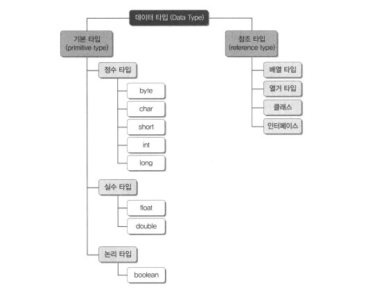
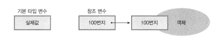
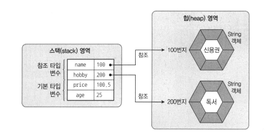
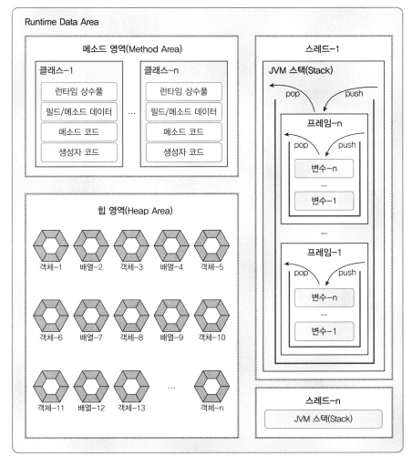
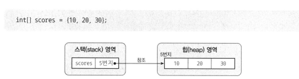

# 5.1 데이터 타입 분류

자바의 데이터 타입에는 크게 기본 타입, 참조 타입을 분류된다.
기본 타입이란 정수, 실수, 문자, 논리 리터럴을 저장하는 타입을 말한다.
참조 타입이란 객체의 번지를 참조하는 타입으로 배열, 열거, 클래스, 인터페이스 타입을 말한다.



기본 타입을 이용해서 선언된 변수는 실제 값을 변수안에 저장하지만, 
**참조 타입을 이용한 변수는 메모리의 번지를 값으로 갖는다.**
번지를 통해 객체를 참조한다는 뜻에서 참조 타입이라고 부른다.



```java
//기본 타입 변수
int age = 25;
double price = 100.5;

//참조 타입 변수
String name = "신용권";
String hobby = "독서";
```



age, price 변수는 직접 값을 저장하고 있지만,
String 클래스 변수인 name,hobby는 객체 주소 값을 가지고 있다.
주소를 통해 객체를 참조한다는 뜻에서 String 클래스 변수를 참조 타입 변수라고 한다.

<br>
<br>

# 5.2 메모리 사용 영역



## 5.2.1 

### 메소드 영역

메소드 영역에는 코드에서 사용되는 클래스들을 클래스 로더로 읽어 클래스별로 런타임 상수풀, 필드, 메소드 데이터, 메소드 코드, 생성자 코드 등을 분류해서 저장한다.
<br>

**메소드 영역은 JVM이 시작할 때 생성되고 모든 스레드가 공유하는 영역이다.**

### 힙(Heap)영역

힙 영역은 객체와 배열이 생성되는 영역이다.
<br>
힙 영역에 생성된 객체와 배열은 JVM 스택 영역의 변수나 다른 객체의 필드에서 참조한다. 참조하는 변수나 필드가 없다면 의미 없는 객체가 되기 때문에 

**JVM은 Garbage Collector를 실행시켜 쓰레기 객체를 힙 영역에서 자동으로 제거한다.**

### JVM 스택(Stack) 영역

**JVM 스택 영역은 각 스레드마다 하나씩 존재하며 스레드가 시작될 때 할당된다.**

JVM 스택은 메소드를 호출할 때마다 프레임을 추가하고 메소드가 종료되면 해당 프레임을 제거하는 동작을 수행한다. 예외 발생시 printStackTrace()메소드로 보여주는 Stack Trace의 각 라인은 하나의 프레임을 표현한다.
<br>
기본 타입 변수는 스택 영역에 직접 값을 가지고 있지만, 참조 타입 변수는 값이 아니라 힙 영역이나 메소드 영역의 객체 주소를 가진다.



배열 변수인 scores는 스택 영역에 생성되지만 실제 10,20,30 을 갖는 배열은 힙 영역에 생성된다. 배열 변수 scores에는 배열의 힙 영역의 주소가 저장된다.

## 5.3 참조 변수의 ==, != 연산

기본 타입 변수의 ==, != 연산은 변수의 값이 같은지, 아닌지를 조사하지만 참조 타입 변수들 간의 ==, != 연산은 동일한 객체를 참조하는지, 다른 객체를 참조하는지 알아볼 때 사용된다.

참조 타입 변수의 값은 힙 영역의 객체 주소이므로 

