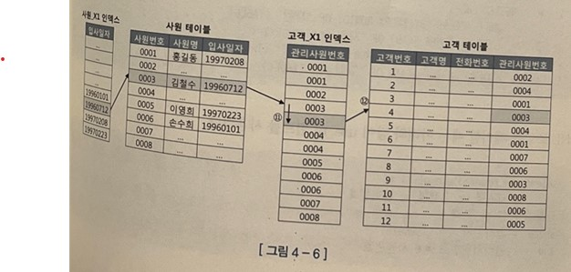

# 4.1 NL조인

> 참고
<BR>1. https://velog.io/@wooncloud/NL%EC%A1%B0%EC%9D%B8
<br>2. https://programmingyoon.tistory.com/263 
<BR> 3. https://positivemh.tistory.com/880

## 4.1.1 NL조인 기본 매커니즘


위 그림의 사원과 고객 테이블이 있다.
<BR>

이 두 테이블에서 1996년 1월 1일 이후 입사한 사원이 관리하는 고객 테이터를 추출하는 프로그램을 작성해 보자.

```
select e.사원, c.고객명, c.전화번호
  from 사원 e, 고객 c
 where e.입사일자 >= '19960101'
   and c.관리사원번호 = e.사원번호
```
지금은 위의 SQL문을 사용하면 원하는 결과집합을 추출할 수 있지만,
SQL이 탄생하기 전에는 두 테이블을 조인하는 프로그램을 개발자가 직접 작성해야만 했다.
<BR>

가장 쉽게 생각할 수 있는 방식은 사원 테이블로 부터 1996년 1월 1일 이후 입사한 사원을 찾아 '건건이' 고객 테이블에서 사원번호가 일치하는 레코드를 찾는 것이다. **이것이 바로 <u>Nested Loop조인</u>이 사용하는 알고리즘이다.**

<br>


<br>
NL조인은 위 중첩 루프문과 같은 수행 구조를 사용한다.

```
BEGIN
    FOR OUTER IN (SEELCT 사원번호, 사원명 
                    FROM 사원
                   WHERE 입사일자 >= '19960101')
    LOOP --OUTER 루프
        FOR INNER IN (SELECT 고객명, 전화번호
                        FROM 고객
                       WHERE 관리사원번호 = OUTER.사원번호)
        LOOP --INNER 루프
            DBMS_OUTPUT.OUT_LINE( 
                OUTER.사원명 || ' : ' || INNER.고객명 || ' : ' || INNER.전화번호
            );
    END LOOP;
        END LOOP;
END;
```

중첩 루프문을 사용하는 위 PL코드는 NL조인이 어떤 순서로 데이터를 액세스하는 지 확인 할수 있다.
<BR>

일반적으로 NL조인은 Outer와 Inner 양쪽 테이블 모두 인덱스를 이용한다.
Outer쪽 테이블(사원)은 사이즈가 크지 않으면 인덱스를 이용하지 않을 수 있다.
Table Full Scan 하더라도 그것은 한 번에 그치기 때문이다.
<BR>

반면 Inner쪽 테이블(고객)은 인덱스를 사용해야 한다. 위 PL을 예로 들어, Inner루프에서 관리사원번호로 고객데이터를 검색할 때 인덱스를 이용하지 않으면, 아래 그림과 같이 Outer 루프에서 읽은 건수만큼 Table Full Scan을 반복하기 떄문이다.


> NL조인은 '인덱스를 이용한 조인 방식'이라고 할 수 있다.

<BR>


<BR>

1. 사원_X1 인덱스에서 입사일자 >= '19960101'인 첫 번째 레코드를 찾는다.
1. 인덱스에서 읽은 ROWID로 사원 테이블 레코드를 찾아간다.
1. 사원 테이블에서 읽은 사원번호 '0006'으로 고객_X1 인덱스를 탐색한다.
1. 고객_X1 인덱스에서 읽은 ROWID로 고객 테이블 레코드를 찾아간다.

<BR>


<BR>

5. 고객_X1 인덱스에서 한 건 더 스캔하고 관리사원번호가 '0006'임을 확인한다.
6. 고객_X1 인덱스에서읽은 ROWID로 고객 테이블 레코드를 찾아간다. (고객_X1 인덱스에서 한 건 더 스캔하고는 관리 사원번호가 '0006'보다 크므로 거기서 인덱스 스캔을 멈춘다.)

<BR>


<BR>

7. 사원_X1 인덱스에서 한 건 더 스캔해서 입사일자가 '19960712'인 레코드를 읽는다.
8. 인덱스에서 읽은 ROWID로 사원 테이블 레코드를 찾아간다.
9. 사원 테이블에서 읽은 사원번호 '0003'으로 고객_X1 인덱스를 탐색한다.
10. 고객_X1 인덱스에서 읽은 ROWID로 고객 테이블 레코드를 찾아간다.

<BR>



<BR>

11. 고객_X1 인덱스에서 한 건 더 스캔하고 관리사원번호가 '0003'임을 확인한다.
12. 고객_X1 인덱스에서 읽은 ROWID로 고객 테이블 레코드를 찾아간다.(고객_X1 인덱스에서 한 건 더 스캔하고는 관리사원번호가 '0003'보다 크므로 인덱스 스캔을 멈춘다.)

<BR>

사원_X1 인덱스에서 입사일자 >= '19960101'인 모든 레코드에 대해 같은 과정을 반복한다.

> 소트 머지 조인과 해시 조인도 각각 Sort Area와 Hash Area에 가공해 둔 데이터를 이용한다는 점만 다를 뿐, 기본적인 조인 프로세싱은 다르지 않다.


## 4.1.2 NL조인 실행계획 제어


<BR>

위는 NL조인 실행계획이다.
<BR> '위쪽 사원 테이블 기준으로 아래쪽 고객 테이블과 NL조인한다' 고  해석하면 된다. 
<BR>
'각 테이블을 액세스할 때 인덱스를 이용한다.' 는 사실도 실행계획에서 확인할 수 있다.
<BR>
NL조인을 제어할 때는 아래와 같이 use_nl 힌트를 사용한다.

```
select /*+ ordered use_nl(c)*/
       e.사원, c.고객명, c.전화번호
  from 사원 e, 고객 c
 where e.입사일자 >= '19960101'
   and c.관리사원번호 = e.사원번호
```

ordered 힌트는 FROM절에 기술한 순서대로 조인하라고 옵티마이저에 지시할 때 사용한다.
<BR>
use_nl 힌트는 NL방식으로 조인하라고 지시할 때 사용한다.
<BR>
위에서는 ordered와 use_nl(c) 힌트를 같이 사용했으므로 사원 테이블기준으로 고객 테이블과 NL방식으로 조인하라는 뜻이다.

>https://programmingyoon.tistory.com/263

세 개 이상 테이블을 조인할 때는 힌트를 아래처럼 사용한다.

```
select /*+ ordered use_nl(B) use_nl(C) use_hash(D)*/
       *
  from A, B, C, D
```

A -> B -> C -> D 순으로 조인하되, B와 조인할 때 그리고 이어서 C와 조인할 때는 NL방식으로 조인하고, D와 조인할 때는 해시 방식으로 조인하라는 뜻이다.
<br>
ordered 대신 아래와 같이 leading 힌트를 사용할 수도 있다.
<BR>
이 힌트를 사용하면 FROM절을 바꾸지 않고도 마음껏 조인 순서를 제어할 수 있다.
<BR>

```
select /*+ leading(C, A, D,B) use_nl(B) use_nl(C) use_hash(D)*/
       *
  from A, B, C, D
```

leading 힌트를 사용함으로 인해 C -> A -> D -> B 순으로 조인이 이루어 진다.

```
select /*+ use_nl(A, B, C, D) */
       *
  from A, B, C, D
```

네 개 테이블을 NL방식으로 조인하되 순서는 옵티마이저가 스스로 정하도록 맡긴 것이다.

## 4.1.3 NL조인 수행 과정 분석

```
select /*+ ordered use_nl(c)*/
       e.사원번호, e.사원명, e.입사일자
     , c.고객번호, c.고객명, c.전화번호, c.최종주문금액 
  from 사원 e, 고객 c
 where c.관리사원번호 = e.사원번호   --------1
   and e.입사일자 >= '19960101'     --------2
   and e.부서코드 = 'Z123'          --------3
   and c.최종주문금액 >= 20000      --------4

   인덱스 구성
    * 사원_PX : 사원번호
    * 사원_X1 : 입사일자
    * 고객_PX : 고객번호
    * 고객_X1 : 관리사원번호
    * 고객_X2 : 최종주문금액
```

두 테이블에 INDEX 힌트를 명시했으므로 둘 다 인덱스를 이용해서 액세스한다. 하지만 인덱스명은 명시하지 않았으므로 어떤 인덱스를 사용할지는 옵티마이저가 결장한다. 
<br>
힌트에 지시한 대로 SQL문을 수행했을 때 실행계획은 아래와 같다. 사용되는 인덱스는 사원_X1과 고객_X1인 것을 알 수 있다.
<br>


<BR>

SQL조건절 우측에 표시한 번호로 조건절 비교 순서를 나열하면, 2 -> 3 -> 1 -> 4 순이다.

1. 조건절 번호 2 : 입사일자 >= '19960101'조건을 만족하는 레코드를 찾기 위해 사원_X1 인덱스를 Range스캔한다.
2. 조건절 번호 3 : 사원_X1인덱스에서 읽은 ROWID로 사원 테이블을 액세스해서 부서코드 = 'Z123'필터 조건을 만족하는지 확인한다.
3. 조건절 번호 1 : 사원 테이블에서 읽은 사원번호 값으로 조인 조건을 만족하는 고객 쪽 레코드를 찾으려고 고객_X1 인덱스를 Range스캔한다
4. 조건절 번호 4 : 고객_X1인덱스에서 읽은 ROWID로 고객 테이블을 액세스해서 최종주문금액 >=20000 필터 조건을 만족하는지 확인한다.

각 단계를 모두 완료하고 다음 단계로 넘어가는 게 아니라 한 레코드씩 순차적으로 진행한다.

<br>


<BR>